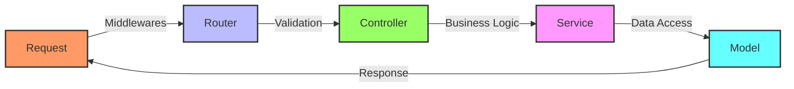
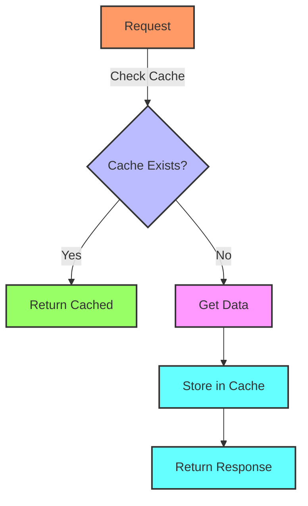
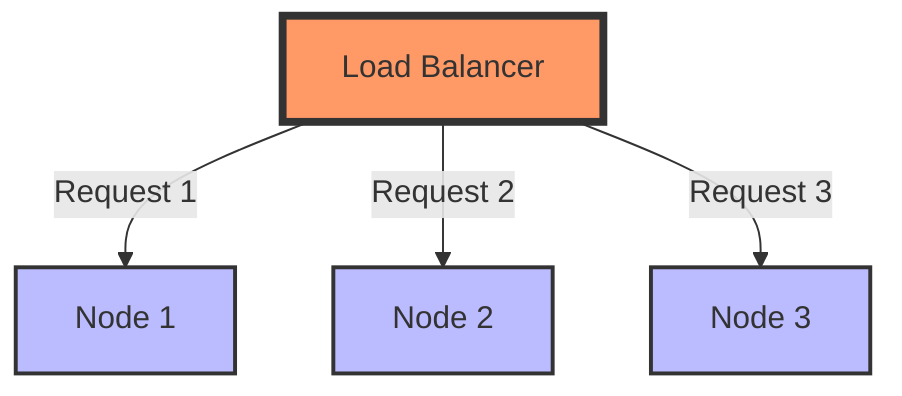
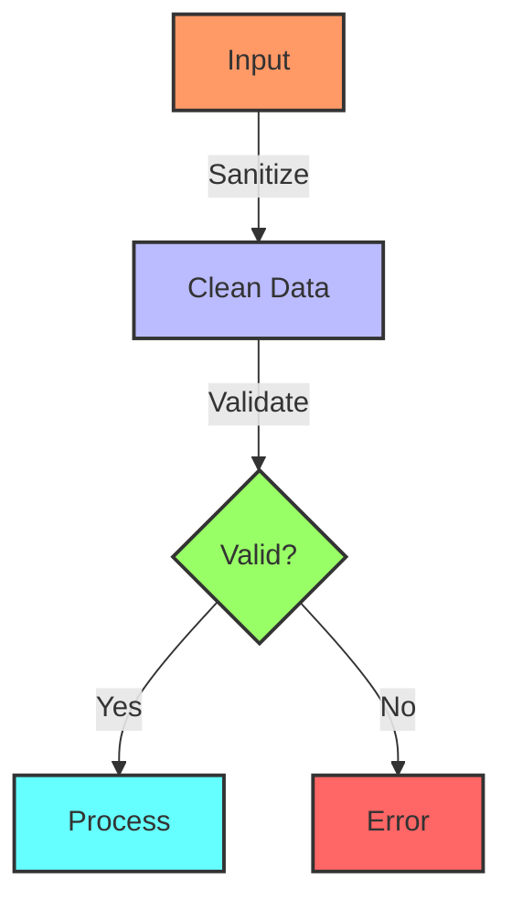
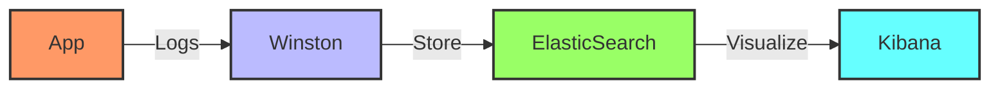
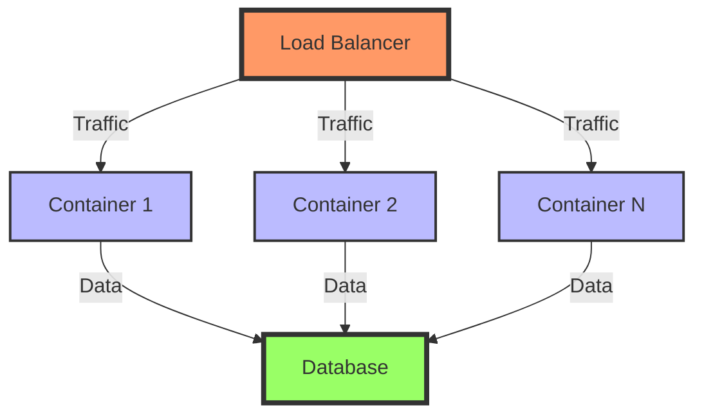

# 🚀 APIs RESTful com Node.js: Guia Definitivo

## 📚 Índice
- [Fundamentos REST](#-fundamentos-rest)
- [Arquitetura da API](#-arquitetura-da-api)
- [Performance e Otimização](#-performance-e-otimização)
- [Segurança](#-segurança)
- [Boas Práticas](#-boas-práticas)
- [Monitoramento e Logs](#-monitoramento-e-logs)
- [Documentação](#-documentação)
- [Deploy e Escalabilidade](#-deploy-e-escalabilidade)

## 🎯 Fundamentos REST

### Princípios REST
1. **Stateless** 
   - Cada requisição é independente
   - Sem sessão no servidor
   - Toda informação necessária está na requisição

2. **Recursos**
   - Identificados por URLs
   - Manipulados através de representações
   - Auto-descritivos

3. **Operações HTTP**
   - GET: Buscar
   - POST: Criar
   - PUT/PATCH: Atualizar
   - DELETE: Remover

### Status Codes Apropriados

| Código | Significado | Uso |
|--------|-------------|-----|
| 200 | OK | Sucesso |
| 201 | Created | Recurso criado |
| 204 | No Content | Sucesso sem conteúdo |
| 400 | Bad Request | Erro do cliente |
| 401 | Unauthorized | Não autenticado |
| 403 | Forbidden | Não autorizado |
| 404 | Not Found | Recurso não encontrado |
| 500 | Server Error | Erro do servidor |

## 🏗️ Arquitetura da API

### Estrutura de Pastas Recomendada

```
src/
├── config/           # Configurações
├── controllers/      # Controladores
├── middlewares/     # Middlewares
├── models/          # Modelos
├── routes/          # Rotas
├── services/        # Lógica de negócio
├── utils/           # Utilitários
└── app.js           # Entrada da aplicação
```

### Fluxo de Requisição



## ⚡ Performance e Otimização

### 1. Caching



### 2. Database Otimização
```javascript
// Índices adequados
db.collection.createIndex({ field: 1 });

// Projeções
db.collection.find({}, { neededField: 1 });

// Paginação
const skip = (page - 1) * limit;
db.collection.find().skip(skip).limit(limit);
```

### 3. Compressão e Buffer
```javascript
// Compressão
app.use(compression());

// Streaming de dados grandes
const stream = fs.createReadStream(file);
stream.pipe(response);
```

### 4. Load Balancing



## 🔒 Segurança

### 1. Autenticação e Autorização
```javascript
// JWT Middleware
const authMiddleware = async (req, res, next) => {
  try {
    const token = req.headers.authorization?.split(' ')[1];
    const decoded = jwt.verify(token, process.env.JWT_SECRET);
    req.user = decoded;
    next();
  } catch (error) {
    res.status(401).json({ error: 'Unauthorized' });
  }
};
```

### 2. Rate Limiting
```javascript
const rateLimit = require('express-rate-limit');

const limiter = rateLimit({
  windowMs: 15 * 60 * 1000, // 15 minutos
  max: 100 // limite por IP
});

app.use(limiter);
```

### 3. Sanitização e Validação



## 📋 Boas Práticas

### 1. Versionamento da API
```
/api/v1/recursos
/api/v2/recursos
```

### 2. Padronização de Respostas
```javascript
// Resposta de sucesso
{
  "success": true,
  "data": {
    // dados
  },
  "meta": {
    "page": 1,
    "total": 100
  }
}

// Resposta de erro
{
  "success": false,
  "error": {
    "code": "INVALID_INPUT",
    "message": "Campo inválido",
    "details": [...]
  }
}
```

### 3. Documentação com Swagger
```javascript
/**
 * @swagger
 * /api/users:
 *   get:
 *     summary: Retorna lista de usuários
 *     responses:
 *       200:
 *         description: Lista de usuários
 */
```

## 📊 Monitoramento e Logs

### 1. Sistema de Logging



### 2. Métricas de Performance
```javascript
// Prometheus + Node.js
const prometheus = require('prom-client');
const counter = new prometheus.Counter({
  name: 'http_requests_total',
  help: 'Total de requisições HTTP'
});
```

## 🚀 Deploy e Escalabilidade

### 1. Containerização

```dockerfile
FROM node:16-alpine
WORKDIR /app
COPY package*.json ./
RUN npm install --production
COPY . .
EXPOSE 3000
CMD ["npm", "start"]
```

### 2. Escalabilidade Horizontal



## 📈 Checklist de Otimização

### Performance
- [ ] Implementar caching
- [ ] Otimizar queries
- [ ] Usar compressão
- [ ] Implementar rate limiting
- [ ] Configurar load balancing

### Segurança
- [ ] Validar inputs
- [ ] Implementar autenticação
- [ ] Configurar CORS
- [ ] Usar HTTPS
- [ ] Implementar rate limiting

### Manutenibilidade
- [ ] Documentar API
- [ ] Implementar logging
- [ ] Monitorar performance
- [ ] Usar versionamento
- [ ] Manter testes atualizados

## 📚 Recursos Adicionais

### 🔗 Links Úteis
- [Node.js Best Practices](https://github.com/goldbergyoni/nodebestpractices)
- [Express.js Documentation](https://expressjs.com/)
- [REST API Design Guide](https://restfulapi.net/)
- [Security Best Practices](https://expressjs.com/en/advanced/best-practice-security.html)

### 💡 Dicas Finais
- Sempre valide inputs
- Implemente monitoramento desde o início
- Mantenha a documentação atualizada
- Use ferramentas de análise de código
- Faça deploy em etapas
- Monitore performance constantemente

Esta documentação fornece:
- Visão completa de APIs RESTful em Node.js
- Diagramas explicativos
- Exemplos práticos
- Checklist de otimização
- Recursos para aprendizado contínuo
