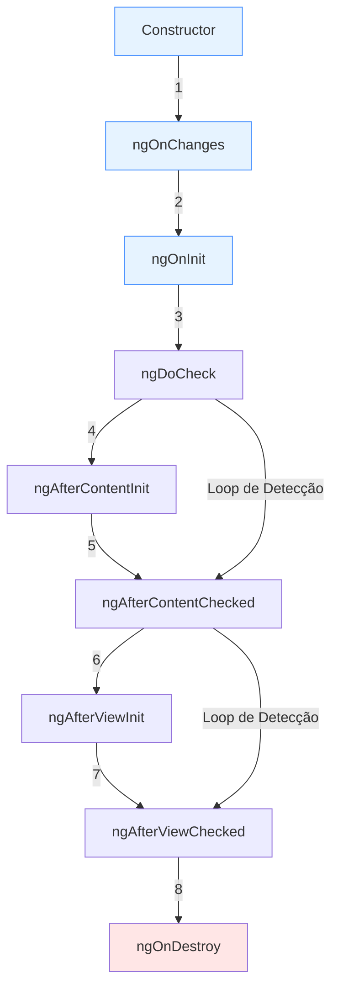

# Angular Lifecycle Hooks - Guia Completo 2024

## 📑 Índice
- [Introdução](#introdução)
- [Visão Geral dos Lifecycles](#visão-geral-dos-lifecycles)
- [Diagramas de Fluxo](#diagramas-de-fluxo)
- [Detalhamento dos Hooks](#detalhamento-dos-hooks)
- [Content vs View Lifecycles](#content-vs-view-lifecycles)
- [Exemplos Práticos](#exemplos-práticos)
- [Performance e Boas Práticas](#performance-e-boas-práticas)
- [Novas Funcionalidades Angular 17+](#novas-funcionalidades-angular-17)
- [Recursos Adicionais](#recursos-adicionais)

## 📝 Introdução

Os Lifecycle Hooks do Angular são métodos especiais que nos permitem intervir em momentos cruciais do ciclo de vida de componentes e diretivas. Eles são fundamentais para:

- Gerenciamento eficiente de recursos
- Otimização de performance
- Manipulação precisa de dados e eventos
- Integração com APIs externas
- Controle do comportamento dos componentes

## 🔄 Visão Geral dos Lifecycles

### Ordem de Execução:
1. constructor()
2. ngOnChanges()
3. ngOnInit()
4. ngDoCheck()
5. ngAfterContentInit()
6. ngAfterContentChecked()
7. ngAfterViewInit()
8. ngAfterViewChecked()
9. ngOnDestroy()

## 📊 Diagramas de Fluxo

### Fluxo Principal



## 🎯 Detalhamento dos Hooks e Seus Casos de Uso

### 1. constructor()
**Por que usar aqui:**
- É o primeiro método chamado na criação do componente
- Executa ANTES de qualquer lifecycle hook
- O componente ainda não está totalmente inicializado
- Perfeito para injeção de dependências porque:
  - O Angular garante que os serviços já estão disponíveis
  - As dependências são necessárias para a configuração inicial do componente

**Por que NÃO usar aqui:**
- @Input() ainda não estão disponíveis
- O DOM ainda não existe
- Não é possível acessar elementos filhos (@ViewChild/@ContentChild)

```typescript
// ✅ CORRETO
export class MyComponent {
  constructor(
    private service: MyService,
    private router: Router
  ) {
    // Apenas injeções e inicializações simples
  }
}

// ❌ ERRADO
export class MyComponent {
  @Input() data: any;
  @ViewChild('myElement') element: ElementRef;
  
  constructor() {
    console.log(this.data); // undefined!
    this.element.nativeElement; // erro!
  }
}
```

### 2. ngOnChanges()
**Por que usar aqui:**
- Primeiro hook que recebe dados dos @Input()
- Executa ANTES do ngOnInit
- Executa a cada mudança nos @Input()
- Perfeito para:
  - Validar dados de entrada
  - Reagir a mudanças nos inputs
  - Transformar dados antes do ngOnInit

**Por que é o melhor lugar para monitorar @Input():**
- Recebe tanto o valor atual quanto o anterior
- Permite comparação de valores
- Executa antes da renderização, evitando flickering

```typescript
// ✅ CORRETO - Uso ideal do ngOnChanges
export class UserCardComponent {
  @Input() user: User;
  displayName: string;

  ngOnChanges(changes: SimpleChanges) {
    if (changes['user']) {
      // Transformação de dados antes da renderização
      this.displayName = this.formatUserName(changes['user'].currentValue);
      
      // Comparação com valor anterior
      if (changes['user'].previousValue?.id !== changes['user'].currentValue?.id) {
        this.loadUserDetails();
      }
    }
  }
}

// ❌ ERRADO - Não use para inicializações que não dependem de @Input
export class UserCardComponent {
  @Input() user: User;
  private subscription: Subscription;

  ngOnChanges() {
    // Isso deveria estar no ngOnInit
    this.subscription = this.service.getData().subscribe();
  }
}
```

### 3. ngOnInit()
**Por que usar aqui:**
- Todos os @Input() já estão inicializados
- O componente já está criado
- Executa apenas UMA vez
- Ideal para:
  - Chamadas HTTP iniciais
  - Subscriptions
  - Inicializações complexas

**Por que é o melhor lugar para inicializações:**
- @Input() já estão disponíveis e estáveis
- Evita problemas de undefined/null
- Separação clara entre injeção (constructor) e inicialização
- Melhor performance que ngDoCheck/AfterViewInit para inicializações

```typescript
// ✅ CORRETO - Uso ideal do ngOnInit
export class DashboardComponent {
  @Input() userId: string;
  private subscription: Subscription;

  constructor(private userService: UserService) {}

  ngOnInit() {
    // Inicialização que depende de @Input
    this.subscription = this.userService
      .getUserData(this.userId) // userId já está disponível
      .pipe(
        tap(user => this.setupUserDashboard(user)),
        catchError(this.handleError)
      )
      .subscribe();
  }
}

// ❌ ERRADO - Não faça inicializações no constructor
export class DashboardComponent {
  @Input() userId: string;

  constructor(private userService: UserService) {
    // userId ainda é undefined aqui!
    this.userService.getUserData(this.userId).subscribe();
  }
}
```

### 4. ngDoCheck()
**Por que usar aqui:**
- Executa durante CADA ciclo de detecção de mudanças
- Permite detecção manual de mudanças
- Ideal para:
  - Mudanças que o Angular não detecta automaticamente
  - Objetos complexos ou aninhados

**Por que é melhor que outras alternativas:**
- Mais flexível que ngOnChanges
- Pode detectar mudanças em objetos/arrays
- Permite lógica customizada de detecção

```typescript
// ✅ CORRETO - Detecção de mudanças complexas
export class ComplexListComponent {
  @Input() items: ComplexItem[];
  private previousItems: string;

  ngDoCheck() {
    // Comparação profunda de objetos
    const currentItems = JSON.stringify(this.items);
    if (this.previousItems !== currentItems) {
      this.previousItems = currentItems;
      this.handleItemsChange();
    }
  }
}

// ❌ ERRADO - Uso excessivo causando problemas de performance
export class SimpleComponent {
  ngDoCheck() {
    // Evite operações pesadas aqui
    this.heavyComputation();
  }
}
```

### 5. ngAfterContentInit()
**Por que usar aqui:**
- Conteúdo projetado (ng-content) já está disponível
- @ContentChild/@ContentChildren já estão inicializados
- Executa UMA vez após a projeção
- Ideal para:
  - Configuração de componentes projetados
  - Inicialização baseada em conteúdo projetado

**Por que é o melhor momento para conteúdo projetado:**
- Garantia que o conteúdo existe
- Evita erros de undefined em elementos projetados
- Permite configuração apropriada de componentes filhos

```typescript
// ✅ CORRETO - Manipulação de conteúdo projetado
@Component({
  selector: 'app-tabs',
  template: `
    <div class="tabs-header">
      <ng-content select="[tabHeader]"></ng-content>
    </div>
    <div class="tabs-content">
      <ng-content></ng-content>
    </div>
  `
})
export class TabsComponent {
  @ContentChildren(TabComponent) tabs: QueryList<TabComponent>;

  ngAfterContentInit() {
    // Configuração segura das tabs projetadas
    this.tabs.forEach((tab, index) => {
      tab.id = `tab-${index}`;
      tab.active = index === 0;
    });
  }
}

// ❌ ERRADO - Tentar acessar conteúdo projetado antes
export class TabsComponent {
  @ContentChildren(TabComponent) tabs: QueryList<TabComponent>;

  constructor() {
    // Erro! tabs ainda não está disponível
    this.tabs.forEach(tab => tab.initialize());
  }
}
```

### 6. ngAfterContentChecked()
**Por que usar aqui:**
- Executa após CADA verificação do conteúdo projetado
- Permite validação contínua do conteúdo
- Ideal para:
  - Validações dinâmicas
  - Reações a mudanças no conteúdo

**Por que é necessário em certos casos:**
- Detecta mudanças que ocorrem após a inicialização
- Permite atualizações baseadas em mudanças do conteúdo
- Mantém sincronização entre pai e filho

```typescript
// ✅ CORRETO - Validação contínua de conteúdo
export class FormContainerComponent {
  @ContentChildren(FormFieldComponent) fields: QueryList<FormFieldComponent>;
  private previousValidState = false;

  ngAfterContentChecked() {
    const currentValidState = this.fields
      .every(field => field.isValid());

    if (currentValidState !== this.previousValidState) {
      this.previousValidState = currentValidState;
      this.updateFormStatus();
    }
  }
}

// ❌ ERRADO - Modificações que causam loops
export class ContainerComponent {
  ngAfterContentChecked() {
    // Erro! Pode causar loop infinito
    this.updateContent();
  }
}
```

### 7. ngAfterViewInit()
**Por que usar aqui:**
- View (template) está completamente inicializada
- @ViewChild/@ViewChildren estão disponíveis
- DOM está pronto para manipulação
- Ideal para:
  - Integração com bibliotecas third-party
  - Manipulação direta do DOM
  - Inicialização de componentes visuais

**Por que é o melhor momento para manipulação visual:**
- Garantia que todos os elementos existem
- Evita erros de elementos undefined
- Permite medições precisas do DOM

```typescript
// ✅ CORRETO - Integração com biblioteca externa
export class ChartComponent {
  @ViewChild('chartCanvas') canvas: ElementRef;
  private chart: Chart;

  ngAfterViewInit() {
    // Seguro - elemento canvas já existe
    this.chart = new Chart(this.canvas.nativeElement, {
      type: 'bar',
      data: this.chartData
    });
  }
}

// ❌ ERRADO - Tentar acessar view antes
export class ChartComponent {
  @ViewChild('chartCanvas') canvas: ElementRef;

  ngOnInit() {
    // Erro! canvas ainda é undefined
    this.initializeChart();
  }
}
```

### 8. ngAfterViewChecked()
**Por que usar aqui:**
- Executa após CADA verificação da view
- Permite validação contínua da view
- Ideal para:
  - Atualizações baseadas em mudanças visuais
  - Sincronização de elementos visuais

**Por que é necessário em certos casos:**
- Detecta mudanças visuais dinâmicas
- Permite ajustes baseados em renderização
- Mantém consistência visual

```typescript
// ✅ CORRETO - Ajustes visuais dinâmicos
export class SliderComponent {
  @ViewChildren('slide') slides: QueryList<ElementRef>;
  private previousSlidesCount = 0;

  ngAfterViewChecked() {
    if (this.slides.length !== this.previousSlidesCount) {
      this.previousSlidesCount = this.slides.length;
      // Uso de setTimeout para evitar ExpressionChangedAfterItHasBeenCheckedError
      setTimeout(() => this.adjustSliderHeight());
    }
  }
}

// ❌ ERRADO - Modificações diretas que causam erro
export class SliderComponent {
  ngAfterViewChecked() {
    // Erro! ExpressionChangedAfterItHasBeenCheckedError
    this.height = this.calculateHeight();
  }
}
```

### 9. ngOnDestroy()
**Por que usar aqui:**
- Último hook antes do componente ser destruído
- Garantia de execução na remoção
- Ideal para:
  - Limpeza de recursos
  - Cancelamento de subscriptions
  - Remoção de event listeners

**Por que é crucial para prevenção de memory leaks:**
- Único momento garantido para limpeza
- Previne vazamentos de memória
- Garante liberação adequada de recursos

```typescript
// ✅ CORRETO - Limpeza completa de recursos
export class DataComponent implements OnDestroy {
  private subscription: Subscription = new Subscription();
  private windowResize: Function;

  ngOnInit() {
    // Agrupa todas as subscriptions
    this.subscription.add(
      this.dataService.getData().subscribe()
    );

    // Adiciona event listener
    this.windowResize = this.renderer.listen('window', 'resize', () => {
      this.onResize();
    });
  }

  ngOnDestroy() {
    // Limpa todas as subscriptions
    this.subscription.unsubscribe();
    
    // Remove event listener
    if (this.windowResize) {
      this.windowResize();
    }
    
    // Limpa intervalos e timeouts
    clearInterval(this.updateInterval);
  }
}

// ❌ ERRADO - Não limpar recursos
export class DataComponent {
  ngOnInit() {
    // Memory leak! Subscription nunca é cancelada
    this.dataService.getData().subscribe();
  }
}
```

## ⚡ Performance e Boas Práticas

### 1. Content vs View
- Content hooks executam ANTES dos View hooks
- Mantenha as responsabilidades separadas
- Não acesse elementos da View em Content hooks

### 2. Cuidados com Hooks Checked
```typescript
// ERRADO ❌
ngAfterViewChecked() {
  this.data = newValue; // Pode causar loop infinito
}

// CORRETO ✅
ngAfterViewChecked() {
  setTimeout(() => this.data = newValue);
}
```

### 3. Otimizações Gerais
- Use `ChangeDetectionStrategy.OnPush`
- Implemente `trackBy` em `ngFor`
- Evite operações pesadas em hooks frequentes

## 🚀 Novas Funcionalidades Angular 17+

### 1. Signals
- Melhor integração com lifecycle hooks
- Performance otimizada em detecção de mudanças

```typescript
@Component({
  selector: 'app-example',
  template: `{{ counter() }}`
})
export class ExampleComponent {
  counter = signal(0);
  
  ngOnInit() {
    effect(() => {
      console.log('Counter changed:', this.counter());
    });
  }
}
```

### 2. Standalone Components
- Ciclo de vida simplificado
- Melhor gerenciamento de dependências

## 📚 Recursos Adicionais

- [Documentação Oficial Angular](https://angular.io/guide/lifecycle-hooks)
- [Angular API Reference](https://angular.io/api)
- [Angular University](https://angular-university.io)

## 🤝 Contribuição

Sinta-se à vontade para contribuir com este guia através de pull requests ou issues.

## 📝 Licença

Este documento está sob a licença MIT.
