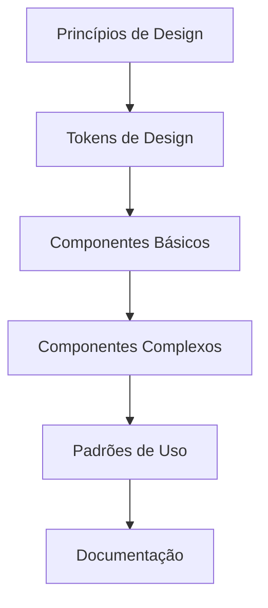

# 🎨 Design System: Guia Definitivo

## 📌 Índice
- [Fundamentos](#fundamentos)
- [Arquitetura](#arquitetura)
- [Implementação](#implementação)
- [Estratégias Avançadas](#estratégias-avançadas)
- [Ferramentas](#ferramentas)
- [Melhores Práticas](#melhores-práticas)
- [Desafios e Soluções](#desafios-e-soluções)

## 🚀 Fundamentos de Design System

### Definição Avançada

Um Design System é muito mais do que uma simples biblioteca de componentes. É uma **metodologia completa** de design e desenvolvimento que engloba:

- 🧩 Componentes reutilizáveis
- 🎨 Guia de estilo unificado
- 📐 Princípios de design
- 🔧 Padrões de implementação
- 🌐 Documentação abrangente

### Arquitetura Conceitual



## 🏗️ Arquitetura Técnica

### Camadas do Design System

1. **Fundação (Design Tokens)**
   - Variáveis de estilo fundamentais
   - Cores
   - Tipografia
   - Espaçamentos
   - Animações

2. **Componentes Básicos**
   - Átomos de design
   - Elementos mínimos reutilizáveis
   - Completamente independentes

3. **Componentes Compostos**
   - Combinação de componentes básicos
   - Lógica de negócio integrada
   - Contexto específico de aplicação

### Exemplo de Estrutura de Tokens

```typescript
// design-tokens.ts
export const DesignTokens = {
  colors: {
    primary: {
      100: '#E6F2FF',
      500: '#0066CC',
      900: '#001A33'
    },
    neutral: {
      white: '#FFFFFF',
      gray: {
        100: '#F5F5F5',
        500: '#757575'
      }
    }
  },
  typography: {
    fontFamily: {
      primary: '"Inter", sans-serif',
      secondary: '"Roboto", sans-serif'
    },
    sizes: {
      small: '12px',
      medium: '16px',
      large: '24px'
    }
  },
  spacing: {
    xs: '4px',
    sm: '8px',
    md: '16px',
    lg: '24px'
  }
};
```

## 🔧 Implementação Avançada

### Estratégias de Componentização

1. **Atomic Design**
   - Átomos
   - Moléculas
   - Organismos
   - Templates
   - Páginas

2. **Critérios de Componentização**
   - Reusabilidade
   - Independência
   - Baixo acoplamento
   - Alta coesão

### Exemplo de Componente Robusto

```typescript
// Button.tsx
interface ButtonProps {
  variant?: 'primary' | 'secondary' | 'outline';
  size?: 'small' | 'medium' | 'large';
  disabled?: boolean;
  fullWidth?: boolean;
  onClick?: () => void;
}

export const Button: React.FC<ButtonProps> = ({
  variant = 'primary',
  size = 'medium',
  disabled = false,
  fullWidth = false,
  children,
  onClick
}) => {
  const classes = cn(
    'button',
    `button--${variant}`,
    `button--${size}`,
    {
      'button--disabled': disabled,
      'button--full-width': fullWidth
    }
  );

  return (
    <button 
      className={classes}
      disabled={disabled}
      onClick={onClick}
    >
      {children}
    </button>
  );
};
```

## 🛠️ Ferramentas Essenciais

1. **Gerenciamento**
   - Storybook
   - Figma
   - Chromatic
   - Zeplin

2. **Desenvolvimento**
   - Styled Components
   - Tailwind CSS
   - CSS Modules
   - TypeScript

3. **Documentação**
   - Docusaurus
   - Storybook Docs
   - MDX

## 🌟 Melhores Práticas

- Mantenha consistência
- Documente exaustivamente
- Crie testes para componentes
- Versione semanticamente
- Automatize processos
- Mantenha flexibilidade

## 🚧 Desafios Comuns

1. **Adoção**
   - Resistência de equipes
   - Curva de aprendizado
   - Alinhamento de expectativas

2. **Manutenção**
   - Evolução constante
   - Compatibilidade
   - Performance

## 📊 Métricas de Sucesso

- Velocidade de desenvolvimento
- Consistência visual
- Reusabilidade de componentes
- Satisfação da equipe
- Redução de bugs

## 💡 Considerações Finais

Design System não é um projeto, é uma **jornada contínua** de evolução e refinamento.

---

**Desenvolvido para Desenvolvedores Front-End que Pensam Além do Código**
