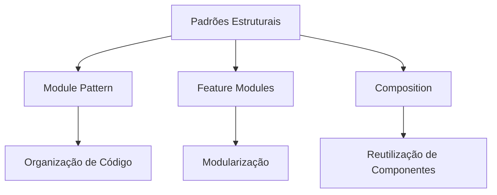
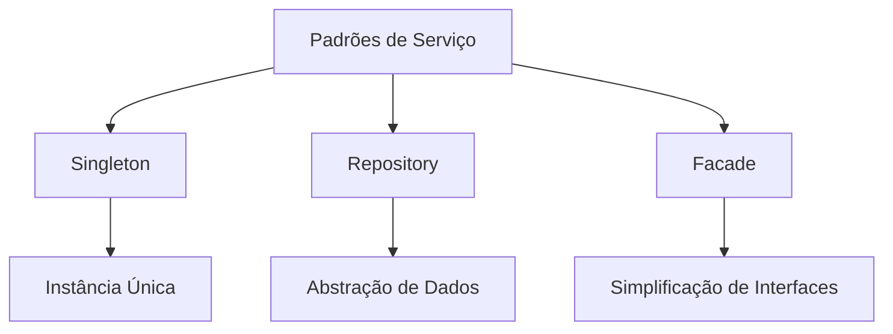
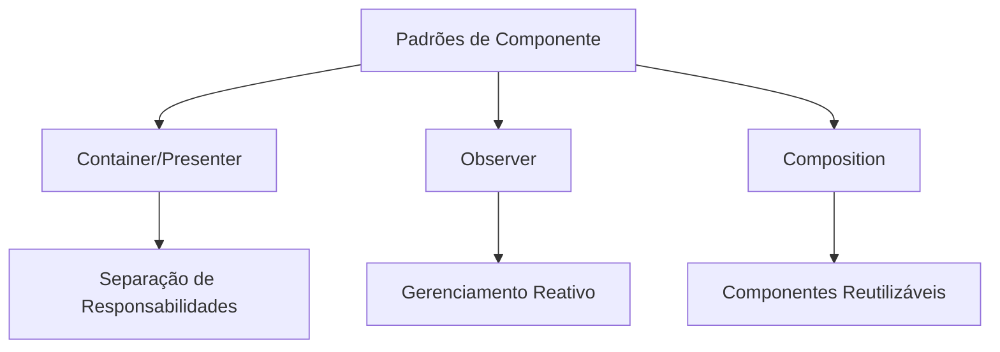
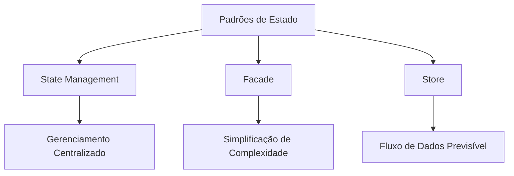

# 🏗️ Design Patterns no Angular

> Arquitetura Inteligente, Código Elegante 🚀

## 🌟 Introdução

Design Patterns são soluções comprovadas para problemas recorrentes no desenvolvimento de software. No Angular, esses padrões nos ajudam a criar aplicações:
- 🧩 Modulares
- 🔒 Escaláveis
- 🚀 Performáticas
- 🤝 Fáceis de manter

## 🗂️ Categorias de Design Patterns

### 1. 🏗️ Padrões Estruturais



#### Module Pattern
- 🔑 Organização nativa do Angular
- 📦 Agrupamento de funcionalidades relacionadas
- 🧩 Controle de escopo e dependências

```typescript
@NgModule({
  declarations: [ComponentesRelacionados],
  imports: [DependênciasNecessárias],
  providers: [ServiçosEspecíficos]
})
export class MeuModuloEspecifico { }
```

### 2. 🤝 Padrões de Serviço



#### Singleton Service
- 🔒 Instância única globalmente
- 💾 Gerenciamento de estado centralizado
- 🌐 Acessível em toda aplicação

```typescript
@Injectable({ providedIn: 'root' })
export class AuthService {
  private currentUser: User | null = null;
  
  login(credentials: Credentials): Observable<User> {
    return this.http.post<User>('/login', credentials)
      .pipe(tap(user => this.currentUser = user));
  }
}
```

### 3. 🖥️ Padrões de Componente



#### Container/Presenter Pattern
- 🧠 Componentes inteligentes (Container)
- 🎨 Componentes de apresentação (Presenter)
- 🔀 Separação clara de responsabilidades

```typescript
// Container (Smart Component)
@Component({
  template: `<app-user-list [users]="users$ | async"></app-user-list>`
})
export class UserListContainerComponent {
  users$ = this.userService.getUsers();
}

// Presenter (Dumb Component)
@Component({
  template: `
    <div *ngFor="let user of users">
      {{ user.name }}
    </div>
  `
})
export class UserListComponent {
  @Input() users: User[] = [];
}
```

### 4. 🔄 Padrões de Estado



#### State Management Pattern
- 📊 Gerenciamento de estado
- 🔄 Fluxo de dados controlado
- 🧩 Previsibilidade

```typescript
@Injectable({ providedIn: 'root' })
export class CartStore {
  private state = new BehaviorSubject<CartState>({
    items: [],
    total: 0
  });

  state$ = this.state.asObservable();

  addItem(item: CartItem): void {
    const currentState = this.state.getValue();
    this.state.next({
      items: [...currentState.items, item],
      total: currentState.total + item.price
    });
  }
}
```

## 🛡️ Boas Práticas

### 1. Dependency Injection
- 🔌 Desacoplamento de dependências
- 🧩 Injeção automática de serviços
- 🚀 Facilita testes e manutenção

### 2. HTTP Interceptors
- 🌐 Interceptação de requisições
- 🔒 Segurança e transformação de requests
- 📡 Manipulação global de chamadas HTTP

## 🏆 Benefícios dos Design Patterns

- 📐 Arquitetura consistente
- 🚀 Código mais limpo e legível
- 🤝 Facilita colaboração
- 💡 Soluções testadas e aprovadas

## 🚦 Conclusão

Design Patterns não são apenas técnicas, são **filosofias de desenvolvimento**. No Angular, eles nos ajudam a criar aplicações robustas, escaláveis e de fácil manutenção.

**Lembre-se**: Padrões são guias, não correntes. Use-os com sabedoria! 🧠✨
