# 🚀 Angular Reactive Forms: Guia Definitivo

[](https://angular.io/)
[](https://www.npmjs.com/)
[](LICENSE)

## 📋 Índice

- [Introdução](#-introdução)
- [Conceitos Fundamentais](#conceitos-fundamentais)
- [Configuração](#configuração)
- [Form Controls](#form-controls)
- [Form Groups](#form-groups)
- [Form Arrays](#form-arrays)
- [Validação](#validação)
- [Form Builders](#form-builders)
- [Observables e Forms](#observables-e-forms)
- [Casos de Uso Avançados](#casos-de-uso-avançados)
- [Performance](#performance)
- [Testes](#testes)
- [Integração com Backend](#integração-com-backend)
- [Melhores Práticas](#melhores-práticas)

## 🎯 Introdução

Reactive Forms é uma abordagem robusta do Angular para manipulação de formulários baseada em programação reativa, oferecendo maior controle, testabilidade e validação dinâmica.

### 🔑 Características Principais

- Abordagem orientada a código
- Imutabilidade
- Previsibilidade
- Tipagem segura
- Facilidade de teste
- Suporte a observables
- Validação síncrona e assíncrona

## 💡 Conceitos Fundamentais

### Hierarquia dos Formulários Reativos

```mermaid
graph TD
    A[FormGroup] -->|contém| B[FormControl]
    A -->|contém| C[FormArray]
    C -->|contém múltiplos| B
    A -->|contém| D[FormGroup Aninhado]
    D -->|contém| B
```



### Classes Principais

1. **AbstractControl**: Classe base para controles de formulário
2. **FormControl**: Controle individual
3. **FormGroup**: Grupo de controles
4. **FormArray**: Array de controles
5. **FormBuilder**: Utilitário para construção de formulários

## 🛠 Configuração

```typescript
// app.module.ts
import { ReactiveFormsModule } from '@angular/forms';

@NgModule({
  imports: [
    ReactiveFormsModule
  ]
})
export class AppModule { }
```

## 📝 Form Controls

### Criação Básica

```typescript
import { FormControl } from '@angular/forms';

export class AppComponent {
  name = new FormControl('');
  
  // Com valor inicial e validadores
  email = new FormControl('', [
    Validators.required,
    Validators.email
  ]);
  
  // Com validação assíncrona
  username = new FormControl('', 
    [], 
    [this.usernameValidator()]
  );
}
```

### Estados e Propriedades

```typescript
// Estados
pristine: boolean;    // Não modificado
dirty: boolean;       // Modificado
touched: boolean;     // Tocado
untouched: boolean;   // Não tocado
valid: boolean;       // Válido
invalid: boolean;     // Inválido
pending: boolean;     // Validação pendente
disabled: boolean;    // Desabilitado
enabled: boolean;     // Habilitado

// Métodos principais
setValue(value: any): void;
patchValue(value: any): void;
reset(): void;
```

## 📦 Form Groups

### Criação Básica

```typescript
import { FormGroup, FormControl } from '@angular/forms';

export class UserFormComponent {
  userForm = new FormGroup({
    firstName: new FormControl(''),
    lastName: new FormControl(''),
    address: new FormGroup({
      street: new FormControl(''),
      city: new FormControl(''),
      zipCode: new FormControl('')
    })
  });
}
```

### Tipagem com Interfaces

```typescript
interface UserForm {
  firstName: string;
  lastName: string;
  address: {
    street: string;
    city: string;
    zipCode: string;
  };
}

userForm = new FormGroup<UserForm>({
  // ... configuração do form
});
```

## 📚 Form Arrays

### Manipulação Dinâmica

```typescript
import { FormArray, FormGroup, FormControl } from '@angular/forms';

export class DynamicFormComponent {
  form = new FormGroup({
    skills: new FormArray([])
  });

  get skills() {
    return this.form.get('skills') as FormArray;
  }

  addSkill() {
    this.skills.push(new FormControl(''));
  }

  removeSkill(index: number) {
    this.skills.removeAt(index);
  }
}
```

### Template Correspondente

```html
<form [formGroup]="form">
  <div formArrayName="skills">
    <div *ngFor="let skill of skills.controls; let i=index">
      <input [formControlName]="i">
      <button (click)="removeSkill(i)">Remove</button>
    </div>
  </div>
  <button (click)="addSkill()">Add Skill</button>
</form>
```

## ✅ Validação

### 1. Validadores Síncronos

```typescript
import { Validators } from '@angular/forms';

const form = new FormGroup({
  password: new FormControl('', [
    Validators.required,
    Validators.minLength(8),
    Validators.pattern(/^(?=.*[A-Za-z])(?=.*\d)[A-Za-z\d]{8,}$/)
  ])
});
```

### 2. Validadores Customizados

```typescript
function passwordMatchValidator(control: AbstractControl): ValidationErrors | null {
  const password = control.get('password');
  const confirmPassword = control.get('confirmPassword');

  if (password?.value !== confirmPassword?.value) {
    return { passwordMismatch: true };
  }
  return null;
}

const form = new FormGroup({
  password: new FormControl(''),
  confirmPassword: new FormControl('')
}, { validators: passwordMatchValidator });
```

### 3. Validadores Assíncronos

```typescript
import { AsyncValidatorFn } from '@angular/forms';

export function uniqueUsernameValidator(userService: UserService): AsyncValidatorFn {
  return (control: AbstractControl): Observable<ValidationErrors | null> => {
    return userService.checkUsername(control.value).pipe(
      map(exists => exists ? { usernameExists: true } : null),
      catchError(() => of(null))
    );
  };
}
```

## 🏗 Form Builders

### Uso Básico

```typescript
import { FormBuilder } from '@angular/forms';

export class UserFormComponent {
  constructor(private fb: FormBuilder) {}

  userForm = this.fb.group({
    firstName: ['', Validators.required],
    lastName: [''],
    address: this.fb.group({
      street: [''],
      city: [''],
      zipCode: ['']
    }),
    phones: this.fb.array([])
  });
}
```

## 🔄 Observables e Forms

### 1. ValueChanges

```typescript
export class FormComponent implements OnInit {
  form = new FormGroup({
    search: new FormControl('')
  });

  ngOnInit() {
    this.form.get('search')?.valueChanges.pipe(
      debounceTime(300),
      distinctUntilChanged(),
      switchMap(value => this.searchService.search(value))
    ).subscribe(results => {
      // Handle results
    });
  }
}
```

### 2. StatusChanges

```typescript
this.form.statusChanges.subscribe(status => {
  console.log('Form Status:', status); // 'VALID', 'INVALID', 'PENDING'
});
```

## 🎯 Casos de Uso Avançados

### 1. Formulários Dinâmicos

```typescript
export class DynamicFormComponent {
  form: FormGroup;

  constructor(private fb: FormBuilder) {
    this.form = this.fb.group({});
  }

  addDynamicControl(config: any) {
    const control = new FormControl('', this.getValidators(config));
    this.form.addControl(config.name, control);
  }

  private getValidators(config: any): ValidatorFn[] {
    const validators: ValidatorFn[] = [];
    if (config.required) validators.push(Validators.required);
    if (config.minLength) validators.push(Validators.minLength(config.minLength));
    // ... mais validadores
    return validators;
  }
}
```

### 2. Formulários Aninhados Complexos

```typescript
interface NestedForm {
  personal: {
    name: string;
    email: string;
  };
  addresses: {
    home: {
      street: string;
      city: string;
    };
    work?: {
      street: string;
      city: string;
    };
  };
  contacts: {
    type: string;
    value: string;
  }[];
}

@Component({
  // ...
})
export class ComplexFormComponent {
  form = this.fb.group<NestedForm>({
    personal: this.fb.group({
      name: [''],
      email: ['']
    }),
    addresses: this.fb.group({
      home: this.fb.group({
        street: [''],
        city: ['']
      }),
      work: this.fb.group({
        street: [''],
        city: ['']
      })
    }),
    contacts: this.fb.array([])
  });
}
```

## 🚀 Performance

### 1. ChangeDetection Optimization

```typescript
import { ChangeDetectionStrategy } from '@angular/core';

@Component({
  changeDetection: ChangeDetectionStrategy.OnPush
})
export class FormComponent {
  // ... implementação
}
```

### 2. Unsubscribe Pattern

```typescript
export class FormComponent implements OnDestroy {
  private destroy$ = new Subject<void>();

  ngOnInit() {
    this.form.valueChanges.pipe(
      takeUntil(this.destroy$)
    ).subscribe(/* ... */);
  }

  ngOnDestroy() {
    this.destroy$.next();
    this.destroy$.complete();
  }
}
```

## 🧪 Testes

### 1. Unit Tests

```typescript
import { ComponentFixture, TestBed } from '@angular/core/testing';
import { ReactiveFormsModule } from '@angular/forms';

describe('UserFormComponent', () => {
  let component: UserFormComponent;
  let fixture: ComponentFixture<UserFormComponent>;

  beforeEach(async () => {
    await TestBed.configureTestingModule({
      imports: [ReactiveFormsModule],
      declarations: [UserFormComponent]
    }).compileComponents();

    fixture = TestBed.createComponent(UserFormComponent);
    component = fixture.componentInstance;
    fixture.detectChanges();
  });

  it('should create form with initial values', () => {
    expect(component.form.get('name')?.value).toBe('');
    expect(component.form.valid).toBeFalse();
  });

  it('should validate required fields', () => {
    const nameControl = component.form.get('name');
    nameControl?.setValue('');
    expect(nameControl?.errors?.['required']).toBeTruthy();
    
    nameControl?.setValue('John');
    expect(nameControl?.errors).toBeNull();
  });
});
```

### 2. Integration Tests

```typescript
import { HttpClientTestingModule } from '@angular/common/http/testing';

describe('UserFormComponent Integration', () => {
  beforeEach(async () => {
    await TestBed.configureTestingModule({
      imports: [
        ReactiveFormsModule,
        HttpClientTestingModule
      ],
      providers: [
        UserService
      ]
    }).compileComponents();
  });

  it('should handle async validation', fakeAsync(() => {
    const username = component.form.get('username');
    username?.setValue('existingUser');
    
    tick(500); // Wait for debounce
    
    expect(username?.errors?.['usernameTaken']).toBeTruthy();
  }));
});
```

## 🔌 Integração com Backend

### 1. Submit Handler

```typescript
export class UserFormComponent {
  constructor(private userService: UserService) {}

  onSubmit() {
    if (this.form.valid) {
      this.userService.createUser(this.form.value).pipe(
        catchError(error => {
          this.handleError(error);
          return EMPTY;
        })
      ).subscribe(response => {
        this.handleSuccess(response);
      });
    }
  }
}
```

### 2. Patch Values from API

```typescript
export class EditUserComponent implements OnInit {
  constructor(
    private userService: UserService,
    private fb: FormBuilder
  ) {}

  ngOnInit() {
    this.userService.getUser(this.userId).pipe(
      tap(user => this.form.patchValue(user)),
      catchError(error => {
        this.handleError(error);
        return EMPTY;
      })
    ).subscribe();
  }
}
```

## 📊 Diagrama de Estados do Form


## 💡 Melhores Práticas

1. **Estrutura do Formulário**
   - Use FormBuilder para criar formulários
   - Organize formulários complexos em componentes menores
   - Mantenha a tipagem forte usando interfaces

2. **Validação**
   - Combine validadores síncronos e assíncronos conforme necessário
   - Crie validadores customizados reutilizáveis
   - Implemente validação no nível do formulário quando necessário

3. **Performance**
   - Use OnPush Change Detection
   - Implemente unsubscribe pattern para observables
   - Evite validações pesadas no template

4. **Manutenibilidade**
   - Documente formulários complexos
   - Mantenha constantes de validação separadas
   - Use enums para valores fixos

5. **Segurança**
   - Valide dados tanto no cliente quanto no servidor
   - Sanitize inputs quando necessário
   - Implemente proteção contra CSRF

## 🎓 Exemplos Avançados

### 1. Form com Validação Cross-Field

```typescript
export class PasswordFormComponent {
  form = this.fb.group({
    password: ['', [
      Validators.required,
      Validators.minLength(8)
    ]],
    confirmPassword: ['']
  }, {
    validators: [this.passwordMatchValidator],
    updateOn: 'blur'
  });

  private passwordMatchValidator(form: AbstractControl): ValidationErrors | null {
    const password = form.get('password');
    const confirmPassword = form.get('confirmPassword');

    if (password?.pristine || confirmPassword?.pristine) {
      return null;
    }

    return password?.value === confirmPassword?.value ? null : { mismatch: true };
  }

  getErrorMessage(controlName: string): string {
    const control = this.form.get(controlName);
    if (control?.errors) {
      if (control.errors['required']) return 'Campo obrigatório';
      if (control.errors['minlength']) return 'Mínimo de 8 caracteres';
      if (control.errors['mismatch']) return 'Senhas não correspondem';
    }
    return '';
  }
}
```

### 2. Form Array Dinâmico com Validação Complexa

```typescript
interface SkillForm {
  name: string;
  level: number;
  yearsExperience: number;
  certifications: {
    name: string;
    date: Date;
  }[];
}

@Component({
  selector: 'app-skills-form',
  template: `
    <form [formGroup]="form">
      <div formArrayName="skills">
        <div *ngFor="let skill of skills.controls; let i=index">
          <div [formGroupName]="i">
            <input formControlName="name" placeholder="Skill name">
            <input type="number" formControlName="level" min="1" max="5">
            <input type="number" formControlName="yearsExperience">
            
            <div formArrayName="certifications">
              <div *ngFor="let cert of getCertifications(i).controls; let j=index">
                <div [formGroupName]="j">
                  <input formControlName="name" placeholder="Certification name">
                  <input type="date" formControlName="date">
                </div>
              </div>
              <button (click)="addCertification(i)">Add Certification</button>
            </div>
          </div>
          <button (click)="removeSkill(i)">Remove Skill</button>
        </div>
      </div>
      <button (click)="addSkill()">Add Skill</button>
    </form>
  `
})
export class SkillsFormComponent {
  form = this.fb.group({
    skills: this.fb.array([])
  });

  get skills() {
    return this.form.get('skills') as FormArray;
  }

  createSkill(): FormGroup {
    return this.fb.group({
      name: ['', Validators.required],
      level: [1, [Validators.required, Validators.min(1), Validators.max(5)]],
      yearsExperience: [0, [Validators.required, Validators.min(0)]],
      certifications: this.fb.array([])
    });
  }

  createCertification(): FormGroup {
    return this.fb.group({
      name: ['', Validators.required],
      date: [null, Validators.required]
    });
  }

  addSkill() {
    this.skills.push(this.createSkill());
  }

  removeSkill(index: number) {
    this.skills.removeAt(index);
  }

  getCertifications(skillIndex: number): FormArray {
    return this.skills.at(skillIndex).get('certifications') as FormArray;
  }

  addCertification(skillIndex: number) {
    const certifications = this.getCertifications(skillIndex);
    certifications.push(this.createCertification());
  }
}
```

### 3. Form com Validação Assíncrona e Cache

```typescript
@Injectable({
  providedIn: 'root'
})
export class ValidationCacheService {
  private cache = new Map<string, boolean>();

  setCacheResult(key: string, result: boolean) {
    this.cache.set(key, result);
    // Limpar cache após 5 minutos
    setTimeout(() => this.cache.delete(key), 5 * 60 * 1000);
  }

  getCacheResult(key: string): boolean | undefined {
    return this.cache.get(key);
  }
}

@Injectable({
  providedIn: 'root'
})
export class CustomValidators {
  constructor(
    private userService: UserService,
    private validationCache: ValidationCacheService
  ) {}

  uniqueUsername(): AsyncValidatorFn {
    return (control: AbstractControl): Observable<ValidationErrors | null> => {
      const username = control.value;
      
      // Verifica cache primeiro
      const cachedResult = this.validationCache.getCacheResult(username);
      if (cachedResult !== undefined) {
        return of(cachedResult ? null : { usernameTaken: true });
      }

      return this.userService.checkUsername(username).pipe(
        debounceTime(300),
        distinctUntilChanged(),
        map(exists => {
          this.validationCache.setCacheResult(username, !exists);
          return exists ? { usernameTaken: true } : null;
        }),
        catchError(() => of(null))
      );
    };
  }
}
```

### 4. Form com Autosave

```typescript
@Component({
  selector: 'app-autosave-form',
  template: `
    <form [formGroup]="form">
      <!-- form fields -->
      <div *ngIf="saving" class="saving-indicator">
        Salvando...
      </div>
      <div *ngIf="lastSaved" class="save-status">
        Último salvamento: {{ lastSaved | date:'medium' }}
      </div>
    </form>
  `
})
export class AutosaveFormComponent implements OnInit, OnDestroy {
  form: FormGroup;
  saving = false;
  lastSaved: Date | null = null;
  private destroy$ = new Subject<void>();
  private saveDebounceTime = 2000; // 2 segundos

  constructor(
    private fb: FormBuilder,
    private formService: FormService
  ) {
    this.form = this.fb.group({
      title: ['', Validators.required],
      content: ['', Validators.required]
    });
  }

  ngOnInit() {
    // Configura autosave
    this.form.valueChanges.pipe(
      debounceTime(this.saveDebounceTime),
      distinctUntilChanged((prev, curr) => JSON.stringify(prev) === JSON.stringify(curr)),
      filter(() => this.form.valid),
      takeUntil(this.destroy$)
    ).subscribe(() => {
      this.autoSave();
    });
  }

  private autoSave() {
    this.saving = true;
    this.formService.save(this.form.value).pipe(
      finalize(() => {
        this.saving = false;
        this.lastSaved = new Date();
      })
    ).subscribe(
      response => console.log('Saved successfully', response),
      error => console.error('Save failed', error)
    );
  }

  ngOnDestroy() {
    this.destroy$.next();
    this.destroy$.complete();
  }
}
```

### 5. Form com Estado Gerenciado (usando NGRX)

```typescript
// actions.ts
export const updateForm = createAction(
  '[Form] Update',
  props<{ formData: any }>()
);

export const saveForm = createAction('[Form] Save');
export const saveFormSuccess = createAction('[Form] Save Success');
export const saveFormFailure = createAction(
  '[Form] Save Failure',
  props<{ error: any }>()
);

// reducer.ts
export interface FormState {
  data: any;
  saving: boolean;
  error: any;
}

export const initialState: FormState = {
  data: null,
  saving: false,
  error: null
};

export const formReducer = createReducer(
  initialState,
  on(updateForm, (state, { formData }) => ({
    ...state,
    data: formData
  })),
  on(saveForm, state => ({
    ...state,
    saving: true
  })),
  on(saveFormSuccess, state => ({
    ...state,
    saving: false,
    error: null
  })),
  on(saveFormFailure, (state, { error }) => ({
    ...state,
    saving: false,
    error
  }))
);

// component.ts
@Component({
  selector: 'app-state-form',
  template: `
    <form [formGroup]="form" (ngSubmit)="onSubmit()">
      <!-- form fields -->
      <div *ngIf="saving$ | async" class="saving-indicator">
        Salvando...
      </div>
      <div *ngIf="error$ | async as error" class="error-message">
        {{ error }}
      </div>
    </form>
  `
})
export class StateFormComponent implements OnInit {
  form: FormGroup;
  saving$ = this.store.select(state => state.form.saving);
  error$ = this.store.select(state => state.form.error);

  constructor(
    private fb: FormBuilder,
    private store: Store<{ form: FormState }>
  ) {
    this.form = this.fb.group({
      // form controls
    });
  }

  ngOnInit() {
    this.form.valueChanges.pipe(
      debounceTime(300)
    ).subscribe(formData => {
      this.store.dispatch(updateForm({ formData }));
    });
  }

  onSubmit() {
    if (this.form.valid) {
      this.store.dispatch(saveForm());
    }
  }
}
```

## 🔧 Utilitários Avançados

### 1. Form Control Factory

```typescript
class FormControlFactory {
  static create(config: {
    value?: any;
    validators?: ValidatorFn[];
    asyncValidators?: AsyncValidatorFn[];
    updateOn?: 'change' | 'blur' | 'submit';
  }): FormControl {
    return new FormControl(
      config.value ?? null,
      {
        validators: config.validators ?? [],
        asyncValidators: config.asyncValidators ?? [],
        updateOn: config.updateOn ?? 'change'
      }
    );
  }
}

// Uso
const control = FormControlFactory.create({
  value: 'initial',
  validators: [Validators.required],
  updateOn: 'blur'
});
```

### 2. Form Value Transformer

```typescript
class FormValueTransformer {
  static transform(value: any, transformations: {
    [key: string]: (value: any) => any
  }): any {
    const result = { ...value };
    
    Object.keys(transformations).forEach(key => {
      if (result.hasOwnProperty(key)) {
        result[key] = transformations[key](result[key]);
      }
    });
    
    return result;
  }
}

// Uso
const formValue = {
  date: '2023-01-01',
  price: '100.50'
};

const transformed = FormValueTransformer.transform(formValue, {
  date: (value) => new Date(value),
  price: (value) => parseFloat(value)
});
```

## 🎨 Padrões de Design

### 1. Form Strategy Pattern

```typescript
interface FormStrategy {
  createForm(): FormGroup;
  validate(form: FormGroup): boolean;
  transform(value: any): any;
}

class UserFormStrategy implements FormStrategy {
  createForm(): FormGroup {
    return new FormGroup({
      name: new FormControl(''),
      email: new FormControl('')
    });
  }

  validate(form: FormGroup): boolean {
    return form.valid;
  }

  transform(value: any): any {
    return {
      ...value,
      createdAt: new Date()
    };
  }
}

class FormContext {
  constructor(private strategy: FormStrategy) {}

  createForm(): FormGroup {
    return this.strategy.createForm();
  }

  validateAndSubmit(form: FormGroup): void {
    if (this.strategy.validate(form)) {
      const transformedValue = this.strategy.transform(form.value);
      // submit transformedValue
    }
  }
}
```

### 2. Form Builder Factory Pattern

```typescript
class CustomFormBuilder {
  private static instance: CustomFormBuilder;
  
  private constructor() {}
  
  static getInstance(): CustomFormBuilder {
    if (!CustomFormBuilder.instance) {
      CustomFormBuilder.instance = new CustomFormBuilder();
    }
    return CustomFormBuilder.instance;
  }

  createUserForm(): FormGroup {
    return new FormGroup({
      // user form controls
    });
  }

  createProductForm(): FormGroup {
    return new FormGroup({
      // product form controls
    });
  }

  // Mais métodos de criação de formulários
}
```

## 📚 Referências e Recursos

1. [Documentação Oficial do Angular](https://angular.io/guide/reactive-forms)
2. [Angular Forms Guide](https://angular.io/guide/forms-overview)
3. [RxJS Documentation](https://rxjs.dev/)
4. [NgRx Documentation](https://ngrx.io/)

## 🤝 Contribuição

Sinta-se à vontade para contribuir com este guia através de pull requests. Toda contribuição é bem-vinda!

## 📄 Licença

Este projeto está licenciado sob a licença MIT - veja o arquivo [LICENSE](LICENSE) para detalhes.
