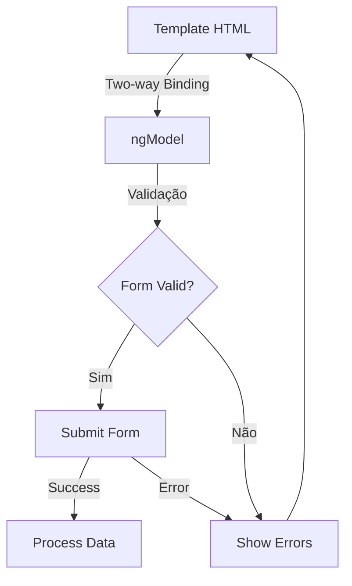

# 📑 Angular Template-Driven Forms: Guia Completo

[](https://angular.io/)
[](https://www.npmjs.com/)
[](LICENSE)

## 📋 Índice

- [Introdução](##introdução)
- [Casos de Uso](#casos-de-uso)
- [Configuração Básica](#configuração-básica)
- [Funcionalidades Básicas](#funcionalidades-básicas)
- [Funcionalidades Avançadas](#funcionalidades-avançadas)
- [Validação](#validação)
- [Boas Práticas](#boas-práticas)
- [Exemplos Práticos](#exemplos-práticos)
- [Troubleshooting](#troubleshooting)

## 🎯 Introdução

Template-Driven Forms são uma abordagem do Angular para manipulação de formulários que se concentra na criação de formulários diretamente no template HTML, com maior parte da lógica sendo gerenciada automaticamente pelo framework.

### 🔑 Características Principais

- Fácil de implementar
- Ideal para formulários simples a médios
- Sintaxe similar ao AngularJS (Angular 1.x)
- Two-way data binding com [(ngModel)]
- Validação baseada em HTML5

## 💡 Casos de Uso

### Recomendado para:
- Formulários simples de login/registro
- Formulários de contato
- Formulários de edição de perfil
- Pequenos formulários de pesquisa
- Formulários com poucos campos e validações simples

### Não recomendado para:
- Formulários dinâmicos complexos
- Formulários com muitas validações customizadas
- Formulários com lógica de negócio complexa
- Formulários que requerem testes unitários extensivos

## 🛠 Configuração Básica

1. **Importação do FormsModule**

```typescript
import { NgModule } from '@angular/core';
import { FormsModule } from '@angular/forms';

@NgModule({
  imports: [
    FormsModule
  ],
  // ...
})
export class AppModule { }
```

2. **Estrutura Básica de um Componente**

```typescript
import { Component } from '@angular/core';

@Component({
  selector: 'app-form',
  template: `
    <form #myForm="ngForm" (ngSubmit)="onSubmit(myForm)">
      <!-- Campos do formulário aqui -->
    </form>
  `
})
export class FormComponent {
  onSubmit(form: NgForm) {
    if (form.valid) {
      console.log(form.value);
    }
  }
}
```

## 📝 Funcionalidades Básicas

### 1. Two-way Binding

```html
<input [(ngModel)]="user.name" name="userName" required>
```

### 2. Form Controls

```html
<form #myForm="ngForm">
  <input #nameCtrl="ngModel" 
         [(ngModel)]="user.name" 
         name="userName" 
         required>
  
  <span *ngIf="nameCtrl.invalid && nameCtrl.touched">
    Campo obrigatório
  </span>
</form>
```

### 3. Form Groups

```html
<form #myForm="ngForm">
  <div ngModelGroup="address">
    <input [(ngModel)]="user.address.street" name="street">
    <input [(ngModel)]="user.address.city" name="city">
  </div>
</form>
```

## 🔄 Funcionalidades Avançadas

### 1. Custom Validators

```typescript
import { Directive } from '@angular/core';
import { NG_VALIDATORS, Validator, AbstractControl } from '@angular/forms';

@Directive({
  selector: '[appCustomValidator]',
  providers: [{
    provide: NG_VALIDATORS,
    useExisting: CustomValidatorDirective,
    multi: true
  }]
})
export class CustomValidatorDirective implements Validator {
  validate(control: AbstractControl): {[key: string]: any} | null {
    // Lógica de validação aqui
    return null;
  }
}
```

### 2. Form States

```html
<form #myForm="ngForm">
  <div>Form Status: {{ myForm.status }}</div>
  <div>Form Touched: {{ myForm.touched }}</div>
  <div>Form Dirty: {{ myForm.dirty }}</div>
  <div>Form Valid: {{ myForm.valid }}</div>
</form>
```

### 3. Custom Controls

```typescript
@Component({
  selector: 'app-custom-input',
  providers: [{
    provide: NG_VALUE_ACCESSOR,
    useExisting: forwardRef(() => CustomInputComponent),
    multi: true
  }],
  template: `
    <input [value]="value" (input)="onChange($event)">
  `
})
export class CustomInputComponent implements ControlValueAccessor {
  // Implementação do ControlValueAccessor
}
```

## ✅ Validação

### 1. Validadores HTML5

```html
<input [(ngModel)]="email" 
       name="email" 
       required 
       email 
       minlength="5" 
       maxlength="50">
```

### 2. Validadores Customizados

```typescript
import { Directive } from '@angular/core';
import { NG_VALIDATORS, Validator, AbstractControl } from '@angular/forms';

@Directive({
  selector: '[appPasswordStrength]',
  providers: [{
    provide: NG_VALIDATORS,
    useExisting: PasswordStrengthValidatorDirective,
    multi: true
  }]
})
export class PasswordStrengthValidatorDirective implements Validator {
  validate(control: AbstractControl): {[key: string]: any} | null {
    const password = control.value;
    const hasNumber = /\d/.test(password);
    const hasUpper = /[A-Z]/.test(password);
    const hasLower = /[a-z]/.test(password);
    
    const valid = hasNumber && hasUpper && hasLower;
    
    return valid ? null : {
      passwordStrength: {
        hasNumber,
        hasUpper,
        hasLower
      }
    };
  }
}
```

### 3. Mensagens de Erro

```html
<div class="form-group">
  <input #passwordCtrl="ngModel" 
         [(ngModel)]="password" 
         name="password"
         required
         appPasswordStrength>
  
  <div *ngIf="passwordCtrl.errors && passwordCtrl.touched">
    <div *ngIf="passwordCtrl.errors['required']">
      Senha é obrigatória
    </div>
    <div *ngIf="passwordCtrl.errors['passwordStrength']">
      A senha deve conter números, letras maiúsculas e minúsculas
    </div>
  </div>
</div>
```

## 📊 Diagrama de Fluxo de Dados



## 🎯 Boas Práticas

1. **Nomeação Consistente**
   - Use prefixos para identificar tipos de campos
   - Mantenha padrões de nomenclatura consistentes

2. **Organização do Código**
   - Separe a lógica de validação em arquivos dedicados
   - Use interfaces para definir modelos de dados
   - Agrupe campos relacionados usando ngModelGroup

3. **Performance**
   - Evite validações complexas no template
   - Use changeDetection: ChangeDetectionStrategy.OnPush
   - Implemente trackBy em ngFor quando necessário

4. **Acessibilidade**
   - Use labels apropriadamente
   - Implemente ARIA attributes
   - Forneça feedback visual e textual para erros

## 💻 Exemplos Práticos

### Formulário de Registro

```typescript
// user.interface.ts
interface User {
  name: string;
  email: string;
  password: string;
  address: {
    street: string;
    city: string;
    country: string;
  };
}

// register.component.ts
@Component({
  selector: 'app-register',
  template: `
    <form #registerForm="ngForm" (ngSubmit)="onSubmit(registerForm)">
      <div class="form-group">
        <label for="name">Nome</label>
        <input id="name"
               [(ngModel)]="user.name"
               name="name"
               required
               minlength="3"
               #nameCtrl="ngModel">
        
        <div *ngIf="nameCtrl.invalid && nameCtrl.touched">
          <div *ngIf="nameCtrl.errors?.['required']">
            Nome é obrigatório
          </div>
          <div *ngIf="nameCtrl.errors?.['minlength']">
            Nome deve ter no mínimo 3 caracteres
          </div>
        </div>
      </div>

      <div ngModelGroup="address">
        <input [(ngModel)]="user.address.street" name="street">
        <input [(ngModel)]="user.address.city" name="city">
        <input [(ngModel)]="user.address.country" name="country">
      </div>

      <button type="submit" [disabled]="registerForm.invalid">
        Registrar
      </button>
    </form>
  `
})
export class RegisterComponent {
  user: User = {
    name: '',
    email: '',
    password: '',
    address: {
      street: '',
      city: '',
      country: ''
    }
  };

  onSubmit(form: NgForm) {
    if (form.valid) {
      console.log('Form submitted', form.value);
    }
  }
}
```

## ❗ Troubleshooting

### Problemas Comuns e Soluções

1. **ngModel não funciona**
   ```typescript
   // Certifique-se de importar FormsModule
   import { FormsModule } from '@angular/forms';
   ```

2. **Validação não dispara**
   ```html
   <!-- Adicione name attribute -->
   <input [(ngModel)]="value" name="fieldName">
   ```

3. **Erro de ExpressionChangedAfterItHasBeenCheckedError**
   ```typescript
   // Use ngAfterViewInit
   ngAfterViewInit() {
     setTimeout(() => {
       // seu código aqui
     });
   }
   ```

## 📚 Recursos Adicionais

- [Documentação Oficial do Angular](https://angular.io/guide/forms-overview)
- [Angular Forms Guide](https://angular.io/guide/forms)
- [Angular Forms Best Practices](https://angular.io/guide/form-validation)

## 🤝 Contribuindo

Sinta-se à vontade para contribuir com este guia através de pull requests. Toda contribuição é bem-vinda!

## 📄 Licença

Este projeto está licenciado sob a licença MIT - veja o arquivo [LICENSE](LICENSE) para detalhes.
