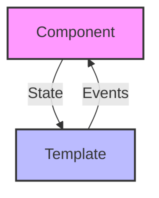
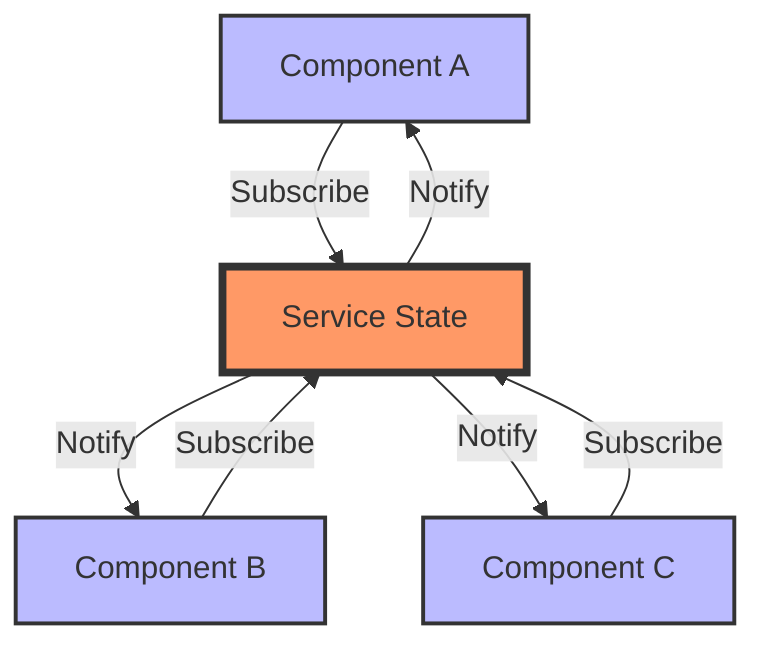
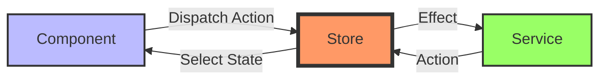
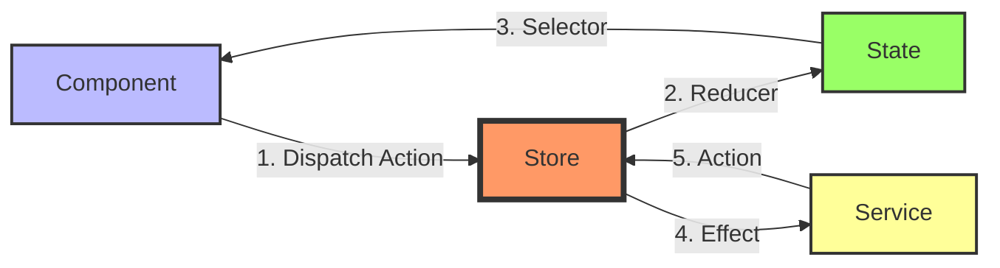
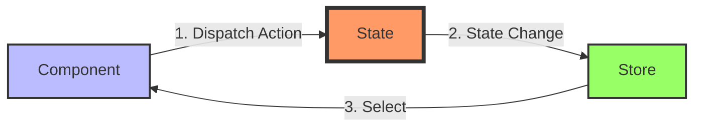

# 🔄 Gerenciamento de Estado no Angular

## 📚 Índice
- [O que é Estado?](#-o-que-é-estado)
- [Tipos de Gerenciamento de Estado](#tipos-de-estado)
- [Soluções Disponíveis](#-soluções-disponíveis)
- [Quando Usar Cada Solução](#-quando-usar-cada-solução)
- [Padrões e Boas Práticas](#-padrões-e-boas-práticas)

## 🎯 O que é Estado?

Estado é qualquer dado que sua aplicação precisa lembrar, como:
- 📝 Dados do usuário
- 🌐 Dados da API
- 📊 Dados de formulários
- 🎨 Configurações da UI
- 🔄 Status de carregamento

### Tipos de Estado
1. **Estado Local** 
   - Pertence a um componente específico
   - Ex: estado de um formulário, toggle de menu

2. **Estado da Aplicação**
   - Compartilhado entre componentes
   - Ex: dados do usuário logado, tema da aplicação

3. **Estado do Servidor**
   - Dados que vêm de APIs
   - Ex: lista de produtos, perfil do usuário

## 🛠️ Tipos de Gerenciamento de Estado

### 1. Gerenciamento Local (Component State)


### 2. Gerenciamento via Serviços (Service State)



### 3. Gerenciamento com Store (NgRx, NGXS, Akita)



## 📦 Soluções Disponíveis

### 1. 🔵 Services + RxJS
**Prós:**
- Simples de implementar
- Nativo do Angular
- Ótimo para aplicações pequenas/médias

**Exemplo Básico:**
```typescript
@Injectable({ providedIn: 'root' })
export class StateService {
  private state = new BehaviorSubject<AppState>(initialState);
  
  getState() {
    return this.state.asObservable();
  }
  
  updateState(newState: Partial<AppState>) {
    this.state.next({ ...this.state.value, ...newState });
  }
}
```

### 2. 🟣 NgRx
**Prós:**
- Baseado no Redux
- Ótimo para aplicações grandes
- Ferramentas de debug poderosas



### 3. 🟢 NGXS
**Prós:**
- Sintaxe mais simples que NgRx
- Menos boilerplate
- Orientado a classes



### 4. 🔴 Akita
**Prós:**
- API simples
- Inspirado no Redux e Vue
- Bom desempenho

## 📊 Quando Usar Cada Solução

### 📈 Matriz de Decisão

| Solução | Complexidade | Tamanho do App | Curva de Aprendizado |
|---------|-------------|----------------|---------------------|
| Services + RxJS | Baixa | Pequeno/Médio | Baixa |
| NgRx | Alta | Grande | Alta |
| NGXS | Média | Médio/Grande | Média |
| Akita | Média | Médio/Grande | Média |

### 🎯 Recomendações

1. **Use Services + RxJS quando:**
   - App pequeno/médio
   - Equipe pequena
   - Necessidades simples de estado

2. **Use NgRx quando:**
   - App grande
   - Múltiplas equipes
   - Necessidade de forte previsibilidade
   - Muitas interações complexas

3. **Use NGXS quando:**
   - Quer os benefícios do NgRx
   - Prefere menos boilerplate
   - Equipe familiar com OOP

4. **Use Akita quando:**
   - Precisa de performance
   - Quer API simples
   - Necessita de boa DX

## 🌟 Padrões e Boas Práticas

### 1. 📋 Organização do Estado
```typescript
interface AppState {
  auth: AuthState;
  ui: UIState;
  data: DataState;
}
```

### 2. 🎯 Princípios SOLID
- Single Responsibility
- Imutabilidade
- Unidirecionalidade

### 3. 📝 Convenções de Nomenclatura
```typescript
// Actions
[Feature] Action Name
// States
FeatureState
// Selectors
select<Feature>
```

### 4. 🔍 Dicas de Performance
- Use memoização em seletores
- Evite estados profundos
- Normalize dados complexos

## 🚀 Começando

### 1. Avalie suas necessidades:
- Tamanho do projeto
- Complexidade do estado
- Experiência da equipe

### 2. Escolha uma solução:
- Comece simples (Services + RxJS)
- Evolua conforme necessário
- Considere a manutenção futura

### 3. Implemente gradualmente:
- Comece com um módulo
- Refatore aos poucos
- Mantenha consistência

## 📚 Recursos Adicionais

### 🔗 Links Úteis
- [NgRx Documentation](https://ngrx.io/)
- [NGXS Documentation](https://www.ngxs.io/)
- [Akita Documentation](https://datorama.github.io/akita/)
- [RxJS Documentation](https://rxjs.dev/)

### 💡 Dicas Finais
- Comece pequeno
- Documente decisões
- Mantenha consistência
- Revise periodicamente


Esta documentação fornece:
- Visão geral clara do gerenciamento de estado
- Diagramas para visualizar os fluxos
- Comparação entre soluções
- Guia de decisão
- Boas práticas
