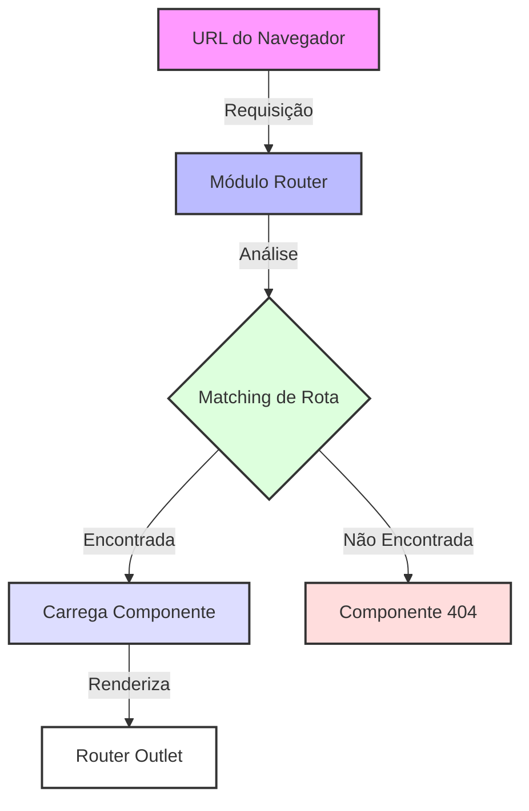
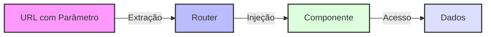
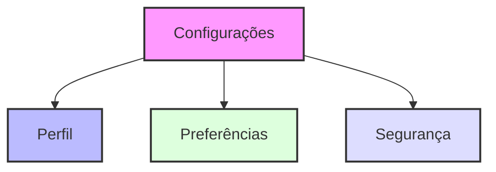

# 🛣️ Guia Completo de Roteamento Angular

## 📋 Índice
- [Introdução](#-introdução)
- [Configuração Básica](#-configuração-básica)
- [Componentes do Router](#-componentes-do-router)
- [Rotas Dinâmicas](#-rotas-dinâmicas)
- [Parâmetros de Consulta](#-parâmetros-de-consulta)
- [Rotas Aninhadas](#-rotas-aninhadas)
- [Routes Guard](#-guardas-de-rota)
- [Lazy Loading](#-carregamento-preguiçoso)
- [Route Resolver](#-resolvedores-de-rota)
- [Navegação](#-navegação)

## 🎯 Introdução

O Angular Router é um mecanismo poderoso para criar Aplicações de Página Única (SPAs) com múltiplas visualizações. Ele permite a navegação entre diferentes componentes enquanto mantém o estado da aplicação e fornece uma experiência melhor ao usuário.

## ⚙️ Configuração Básica

### Diagrama de Funcionamento do Router



### 🛠️ Configuração das Rotas

```typescript
const rotas: Routes = [
  { path: 'painel', component: PainelComponent },
  { path: 'produtos', component: ProdutosComponent },
  { path: 'configuracoes', component: ConfiguracoesComponent },
  { path: '', redirectTo: '/painel', pathMatch: 'full' },
  { path: '**', component: NaoEncontradoComponent }
];
```

#### 🔑 Pontos Importantes:
- Rotas são definidas em um array de objetos Route
- Cada rota mapeia um caminho URL para um componente
- O caminho vazio ('') geralmente redireciona para uma rota padrão
- A rota coringa ('**') captura todos os caminhos não correspondidos
- A ordem é crucial! Rotas mais específicas devem vir antes das genéricas

## 🧩 Componentes do Router

### Router Outlet
```html
<router-outlet></router-outlet>
```
O `router-outlet` atua como um espaço reservado onde o router renderiza o componente da rota ativa.

### 🔗 Links do Router
```html
<a routerLink="/painel" routerLinkActive="ativo">Painel</a>
```

#### Recursos dos Links:
- `routerLink`: Diretiva para navegação
- `routerLinkActive`: Adiciona classes CSS quando a rota está ativa
- `[routerLinkActiveOptions]="{exact: true}"`: Garante correspondência exata do caminho

## 📝 Rotas Dinâmicas

### Rotas com Parâmetros
```typescript
// Definição da rota
{ path: 'paginas/:paginaId', component: PaginaComponent }

// Implementação do componente
export class PaginaComponent {
  paginaId = input.required<string>();
}
```

### Diagrama de Rotas Dinâmicas



## 🔍 Parâmetros de Consulta

```typescript
// URL: /paginas/1?limite=20
export class PaginaComponent {
  limite = input.required<string>();
}
```

### Características dos Parâmetros de Consulta:
- 📌 Parâmetros opcionais nas URLs
- 🎯 Não afetam o matching de rota
- 🔍 Úteis para filtros, paginação e busca
- 💾 Podem ser preservados entre navegações

## 📦 Rotas Aninhadas

### Estrutura de Rotas Aninhadas



```typescript
{
  path: 'configuracoes',
  component: ConfiguracoesComponent,
  children: [
    { path: 'perfil', component: PerfilComponent },
    { path: 'preferencias', component: PreferenciasComponent }
  ]
}
```

## 🛡️ Guardas de Rota

```typescript
export function guardaAuth(): Observable<boolean> | boolean {
  const usuarioAtual = inject(ServicoUsuario);
  
  if (usuarioAtual.dados) {
    return true;
  }
  
  const router = inject(Router);
  router.navigate(['/']);
  return false;
}
```

### Tipos de Guardas:
- 🔒 CanActivate: Controle de acesso à rota
- 🚫 CanDeactivate: Prevenção de saída não autorizada
- 📥 CanLoad: Controle de carregamento lazy
- 👥 CanActivateChild: Controle de acesso às rotas filhas

## 💤 Lazy Loading

```typescript
{
  path: 'produtos',
  loadComponent: () => import('./produtos/produtos.component')
    .then(m => m.ProdutosComponent)
}
```

### Benefícios:
- 📦 Redução do tamanho inicial do bundle
- ⚡ Melhoria no tempo de inicialização
- 🎯 Carregamento sob demanda
- 💪 Melhor utilização de recursos

## 📊 Resolvedores de Rota

```typescript
export function resolvedorPagina(): Observable<DadosPagina> {
  return new Observable<DadosPagina>(observer => {
    observer.next({ paginaId: '1', nome: 'Página Exemplo' });
    observer.complete();
  });
}
```

### Características:
- 📥 Pré-carregamento de dados
- ✅ Garantia de disponibilidade dos dados
- 🚫 Prevenção de views parcialmente carregadas
- 🎯 Melhoria na experiência do usuário

## 🧭 Navegação

### Navegação Programática
```typescript
export class PainelComponent {
  private router = inject(Router);

  irParaProdutos() {
    this.router.navigate(['/produtos']);
  }
}
```

## 📚 Melhores Práticas

### 1. 🏗️ Organização de Rotas
- Organize por funcionalidade
- Use lazy loading para módulos grandes
- Mantenha convenções claras de nomenclatura

### 2. 🔒 Segurança
- Implemente guardas de rota
- Valide parâmetros
- Trate acessos não autorizados

### 3. ⚡ Performance
- Utilize lazy loading
- Implemente estratégias de preloading
- Otimize resolvedores

### 4. 👥 Experiência do Usuário
- Forneça indicadores de carregamento
- Trate rotas 404
- Mantenha histórico do navegador

## ⚠️ Armadilhas Comuns

### 1. Ordem das Rotas
- ⬆️ Rotas específicas antes das genéricas
- ⬇️ Rota coringa por último
- 🔄 Verifique padrões conflitantes

### 2. Guardas e Resolvedores
- ⏱️ Não bloqueie a UI desnecessariamente
- ❌ Trate erros adequadamente
- 💬 Forneça feedback aos usuários

## 🎉 Conclusão

O Angular Router é um sistema sofisticado que fornece a base para aplicações web complexas. Compreender seus recursos e melhores práticas é crucial para construir aplicações escaláveis e manteníveis.

Para mais informações detalhadas, consulte a [documentação oficial do Angular](https://angular.io/guide/router).

---
📱 Desenvolvido com ❤️ para a comunidade Angular Brasil
