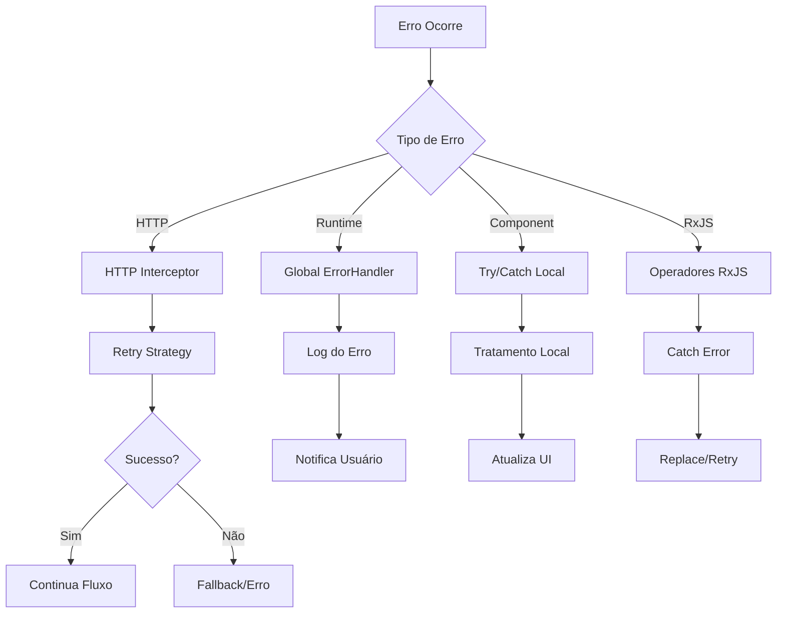

# 🛡️ Error Handling em Angular: Um Guia Completo

[](https://angular.io)
[](https://www.typescriptlang.org/)
[](https://rxjs.dev)

## 🎯 O que é Error Handling?

Error Handling (ou Tratamento de Erros) é uma parte crucial de qualquer aplicação que nos permite:
- Capturar erros de forma elegante
- Prevenir quebras na aplicação
- Melhorar a experiência do usuário
- Facilitar a manutenção e debug
- Garantir a resiliência da aplicação

Imagine o Error Handling como um sistema de airbags do seu carro: você espera nunca precisar, mas quando algo dá errado, ele está lá para proteger!



## 🌟 Por que é importante?

Imagine estes cenários comuns:

1. 🌐 **Servidor Fora do Ar**
   ```typescript
   // Sem tratamento de erro:
   "Erro 500: Internal Server Error" // 😱 Usuário assustado!
   
   // Com tratamento de erro:
   "Estamos com uma instabilidade temporária. 
    Tente novamente em alguns minutos" // 😌 Usuário informado!
   ```

2. 📱 **Sem Internet**
   ```typescript
   // Sem tratamento:
   "Failed to fetch" // 😕 Que erro é esse?
   
   // Com tratamento:
   "Verifique sua conexão com a internet" // 👍 Agora sim!
   ```

## 🛠️ Tipos de Error Handling

### 1. Try/Catch Local

O mais básico e direto! Ideal para erros síncronos que você sabe que podem acontecer.

```typescript
@Component({...})
export class MeuComponent {
  salvarDados() {
    try {
      // Código que pode dar erro
      this.validarDados();
      this.salvar();
    } catch (erro) {
      // Tratamento amigável
      if (erro instanceof DadosInvalidosError) {
        this.mensagem = "Ops! Verifique os dados e tente novamente";
      } else {
        this.mensagem = "Algo deu errado. Tente novamente mais tarde";
        throw erro; // Repassa para o handler global
      }
    }
  }
}
```

### 2. 🌍 Global Error Handler

O super-herói que pega todos os erros não tratados! É como uma rede de segurança para sua aplicação.

```typescript
@Injectable()
export class SuperErrorHandler implements ErrorHandler {
  constructor(
    private notificacao: NotificacaoService,
    private logger: LoggerService
  ) {}

  handleError(erro: unknown) {
    // 1. Identifica o tipo de erro
    const erroTratado = this.identificarErro(erro);
    
    // 2. Registra para análise posterior
    this.logger.registrar({
      tipo: erroTratado.tipo,
      mensagem: erroTratado.mensagem,
      stack: erroTratado.stack,
      data: new Date()
    });

    // 3. Notifica o usuário de forma amigável
    this.notificacao.mostrar({
      tipo: 'erro',
      mensagem: erroTratado.mensagemUsuario,
      duracao: 5000
    });
  }
}
```

### 3. 🌐 HTTP Interceptor

O guarda de trânsito dos seus requests HTTP! Controla, monitora e trata erros de rede.

```typescript
@Injectable()
export class SuperInterceptor implements HttpInterceptor {
  intercept(req: HttpRequest<any>, next: HttpHandler) {
    return next.handle(req).pipe(
      // Tenta 3 vezes antes de desistir
      retry({
        count: 3,
        delay: (erro, tentativa) => {
          console.log(`Tentativa ${tentativa} de 3`);
          return timer(tentativa * 1000); // Espera progressiva
        }
      }),
      
      catchError(erro => {
        if (erro instanceof HttpErrorResponse) {
          switch (erro.status) {
            case 404:
              return throwError(() => new RecursoNaoEncontradoError());
            case 401:
              return throwError(() => new NaoAutorizadoError());
            case 0:
              return throwError(() => new SemConexaoError());
            default:
              return throwError(() => new ErroServidorError());
          }
        }
        return throwError(() => erro);
      })
    );
  }
}
```

### 4. 🔄 RxJS Error Handling

O maestro das operações assíncronas! Perfeito para streaming de dados e operações complexas.

```typescript
@Injectable()
export class DadosService {
  carregarDados() {
    return this.http.get<Dados[]>('/api/dados').pipe(
      // Se der erro, tenta do cache
      catchError(() => this.carregarDoCache()),
      
      // Se ainda der erro, retorna array vazio
      catchError(() => of([])),
      
      // Notifica qualquer erro
      tap({
        error: (erro) => this.notificar(erro)
      }),
      
      // Sempre limpa o loading
      finalize(() => this.loading = false)
    );
  }
}
```

## 🎨 Padrões de Error Handling

1. **Padrão Circuit Breaker**
   **Propósito**: 
    - Prevenir falhas em cascata em sistemas distribuídos
    - Proteger recursos do sistema
    - Permitir recuperação gradual

   **Estados do Circuit Breaker**:
     - FECHADO
       - Estado normal de operação
       - Monitora taxa de falhas
       - Permite todas as requisições
    
     - ABERTO
       - Ativado após múltiplas falhas
       - Bloqueia requisições
       - Inicia temporizador de recuperação
    
     - MEIO-ABERTO
       - Estado de teste
       - Permite requisições limitadas
       - Monitora sucesso para recuperação

```typescript
@Injectable()
export class CircuitBreakerService {
  private falhas = 0;
  private readonly limiar = 5;
  private readonly tempoReset = 30000; // 30 segundos

  executar<T>(operacao: () => Observable<T>): Observable<T> {
    if (this.falhas >= this.limiar) {
      return throwError(() => new CircuitoBloqueadoError());
    }

    return operacao().pipe(
      tap({ 
        next: () => this.resetarFalhas(),
        error: () => this.registrarFalha()
      })
    );
  }
}
```

2. **Padrão Fallback**
    **Propósito**:
    - Fornecer alternativas quando operação principal falha
    - Garantir continuidade do serviço
    - Melhorar experiência do usuário
   **Níveis de Fallback**:
    - Retry da operação original
    - Cache local
    - Dados offline
    - Dados padrão
       
```typescript
@Injectable()
export class DadosService {
  carregarDados(): Observable<Dados[]> {
    return this.online$.pipe(
      switchMap(online => {
        if (online) {
          return this.http.get<Dados[]>('/api/dados').pipe(
            tap(dados => this.cache.salvar('dados', dados)),
            catchError(() => this.carregarFallback())
          );
        }
        return this.carregarFallback();
      })
    );
  }

  private carregarFallback(): Observable<Dados[]> {
    return this.cache.carregar('dados').pipe(
      catchError(() => of([])) // Último recurso
    );
  }
}
```

## 🎯 Melhores Práticas

1. **Hierarquia de Erros**
   ```typescript
   // Base para todos os erros da aplicação
   export abstract class AppError extends Error {
     constructor(
       public mensagemUsuario: string,
       public codigo: string,
       mensagemTecnica?: string
     ) {
       super(mensagemTecnica || mensagemUsuario);
       this.name = this.constructor.name;
     }
   }

   // Erros específicos
   export class ErroValidacao extends AppError {
     constructor(campo: string) {
       super(
         `O campo ${campo} está inválido`,
         'ERR_VALIDACAO'
       );
     }
   }
   ```

2. **Mensagens Amigáveis**
   ```typescript
   const MENSAGENS_ERRO = {
     404: 'Não encontramos o que você procura',
     401: 'Você precisa fazer login novamente',
     403: 'Você não tem permissão para esta ação',
     0: 'Verifique sua conexão com a internet',
     default: 'Ops! Algo deu errado. Tente novamente mais tarde'
   };
   ```

## 📊 Monitoramento de Erros

```typescript
@Injectable()
export class MonitoramentoService {
  registrarErro(erro: unknown) {
    const dadosErro = {
      tipo: erro.constructor.name,
      mensagem: erro.message,
      stack: erro.stack,
      data: new Date(),
      usuario: this.auth.getUserId(),
      url: window.location.href,
      navegador: navigator.userAgent
    };

    // Envia para serviço de monitoramento
    this.http.post('/api/logs', dadosErro).subscribe();
  }
}
```

## 🎓 Dicas Pro

1. **Sempre forneça contexto**
   ```typescript
   throw new AppError(
     'Não foi possível salvar o documento',
     'ERR_SAVE_DOC',
     `Falha ao salvar documento ${docId}: ${error.message}`
   );
   ```

2. **Use tipagem forte**
   ```typescript
   type ErrorType = 'validation' | 'network' | 'auth' | 'unknown';
   
   interface ErrorMetadata {
     type: ErrorType;
     code: string;
     timestamp: Date;
     context?: Record<string, unknown>;
   }
   ```

3. **Centralize a lógica de retry**
   ```typescript
   const retryStrategy = {
     count: 3,
     delay: (erro: HttpErrorResponse, tentativa: number) => {
       if (erro.status === 404) return EMPTY; // Não retenta 404
       return timer(Math.pow(2, tentativa) * 1000); // Exponential backoff
     }
   };
   ```

## 🎯 Conclusão

Error Handling é como um sistema imunológico para sua aplicação. Quando bem implementado:
- Previne crashes
- Melhora UX
- Facilita debug
- Aumenta confiabilidade
- Reduz tempo de resolução de problemas

Lembre-se: Erros sempre acontecerão, o importante é como você lida com eles! 

## 📚 Recursos Adicionais

- [Documentação Oficial Angular](https://angular.io/guide/error-handling)
- [RxJS Error Handling](https://rxjs.dev/guide/operators#error-handling)
- [TypeScript Error Handling](https://www.typescriptlang.org/docs/handbook/error-handling.html)

---

💡 **Dica Final**: Um bom sistema de tratamento de erros é invisível para o usuário quando tudo funciona, mas extremamente útil quando algo dá errado!
