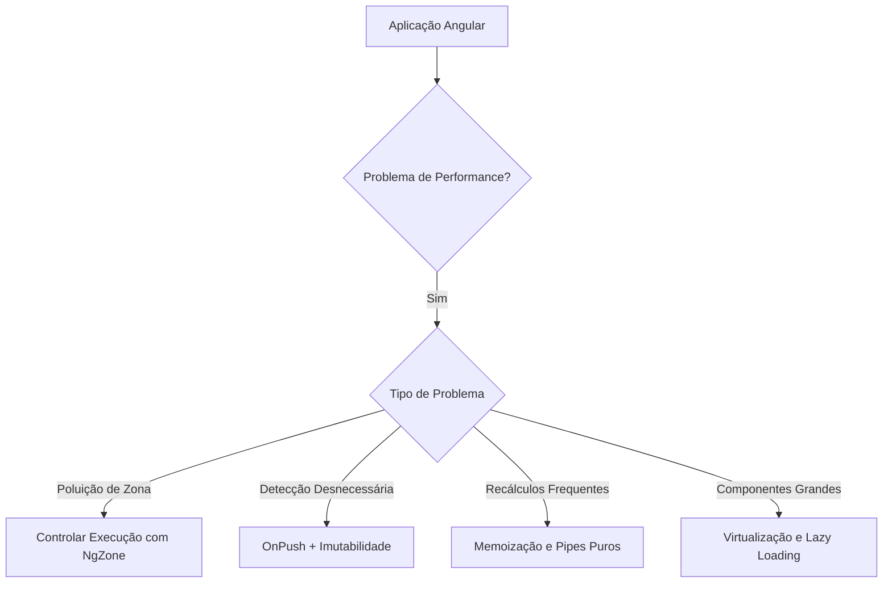

# 🚀 Angular: 4 - Runtime Optmizations

## 📌 Índice Aprofundado

### 1. 💥 Poluição de Zona (Zone Pollution)

#### 🔍 **O Que É Zona no Angular?**
- Mecanismo de rastreamento de todas as tarefas assíncronas
- Automatically triggers change detection
- Monitora eventos como:
  - Clicks
  - Requisições HTTP
  - Timers
  - Promises
  - Observables

#### 🚨 Problemas Típicos
- Detecção de mudanças excessiva
- Performance degradada
- Renderizações desnecessárias

#### 💡 Estratégias de Solução
- Executar código fora da zona do Angular
- Usar `NgZone.runOutsideAngular()`
- Controlar manualmente quando disparar change detection

#### 🧩 Exemplo Completo
```typescript
@Component({
  selector: 'app-chart',
  template: '<div id="plotlyChart"></div>'
})
export class ChartComponent implements OnInit {
  // Injeção do NgZone para controle de zona
  constructor(private ngZone: NgZone) {}

  ngOnInit() {
    // Executa inicialização fora da zona do Angular
    this.ngZone.runOutsideAngular(() => {
      const chartData = [
        {
          x: ['Jan', 'Feb', 'Mar'],
          y: [10, 15, 13],
          type: 'bar'
        }
      ];

      Plotly.newPlot('plotlyChart', chartData, {
        // Configurações de layout
        responsive: true
      });

      // Adiciona listeners fora da zona
      const chartElement = document.getElementById('plotlyChart');
      chartElement.addEventListener('click', () => {
        // Lógica de interação sem disparar detecção de mudanças
        console.log('Chart clicked');
      });
    });
  }
}
```

### 2. 🔄 Detecção de Mudanças Desnecessária

#### 🤔 **O Que São Listas Imutáveis?**
- Estruturas de dados que NÃO podem ser modificadas após criação
- Cada operação cria uma nova instância
- Bibliotecas populares: 
  - Immutable.js
  - Immer
  - RxJS Immutable Helpers

#### 🎯 Benefícios
- Previsibilidade do estado
- Mais fácil rastrear mudanças
- Otimização de performance
- Compatível com `ChangeDetectionStrategy.OnPush`

#### 🚀 Exemplo Detalhado
```typescript
import { List } from 'immutable';

@Component({
  changeDetection: ChangeDetectionStrategy.OnPush
})
export class UserManagerComponent {
  // Lista imutável inicial
  users = List<User>([
    { id: 1, name: 'João' },
    { id: 2, name: 'Maria' }
  ]);

  // Adicionar usuário SEMPRE cria nova instância
  addUser(newUser: User) {
    // Método imutável de adicionar
    this.users = this.users.push(newUser);
  }

  // Remover usuário também cria nova lista
  removeUser(userId: number) {
    this.users = this.users.filter(user => user.id !== userId);
  }
}
```

### 3. 🔢 Recálculo de Expressões Transparentes

#### 💡 **O Que São Expressões Transparentes?**
- Funções/métodos que sempre retornam mesmo resultado para mesmos inputs
- Não causam efeitos colaterais
- Ideais para memoização e caching

#### 🛠 Técnicas de Otimização
- Pipes puros
- Memoização
- Computação lazy
- Caching de resultados

#### 🧠 Exemplo Avançado
```typescript
// Pipe com memoização inteligente
@Pipe({
  name: 'complexCalculation',
  pure: true  // Só recalcula quando input muda
})
export class ComplexCalculationPipe implements PipeTransform {
  private cache = new Map<string, number>();

  transform(input: string): number {
    // Verifica cache antes de calcular
    if (this.cache.has(input)) {
      return this.cache.get(input);
    }

    // Cálculo custoso
    const result = this.expensiveComputation(input);
    
    // Armazena em cache
    this.cache.set(input, result);
    
    return result;
  }

  private expensiveComputation(input: string): number {
    // Simulação de cálculo complexo
    return input.length * Math.PI;
  }
}
```

### 4. 🌳 Otimização de Árvores de Componentes Grandes

#### 🤯 **Desafios de Componentes Massivos**
- Renderização lenta
- Alto consumo de memória
- Ciclos de change detection lentos

#### 💡 Estratégias de Mitigação
- Virtualização (renderizar só o visível)
- Lazy loading
- Code splitting
- Paginação
- Renderização sob demanda

#### 🚀 Exemplo de Virtualização
```typescript
@Component({
  template: `
    <cdk-virtual-scroll-viewport itemSize="50" class="viewport">
      <div *cdkVirtualFor="let item of massiveDataSet">
        {{ item.name }}
      </div>
    </cdk-virtual-scroll-viewport>
  `
})
export class MassiveListComponent {
  // 100.000 itens renderizados eficientemente
  massiveDataSet = Array(100000)
    .fill(0)
    .map((_, index) => ({ 
      id: index, 
      name: `Item ${index}` 
    }));
}
```

## 🏆 Princípios Fundamentais

1. **Minimize Trabalho na Renderização**
2. **Use Estratégias Imutáveis**
3. **Controle Manualmente Zonas e Change Detection**
4. **Cache Resultados Custosos**
5. **Renderize Sob Demanda**

## 📊 Diagrama de Estratégias



## 🔗 Recursos Adicionais
- Documentação Oficial Angular
- Angular Performance Guide
- Ferramentas de Profiling

## 📄 Licença
MIT License
