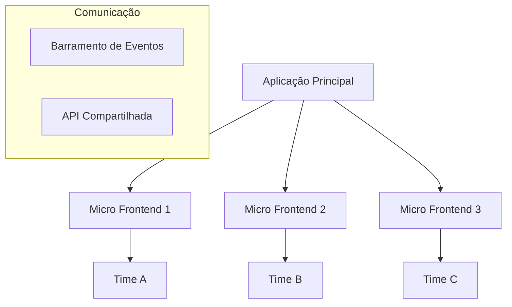
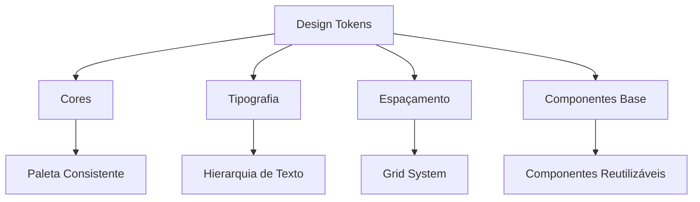
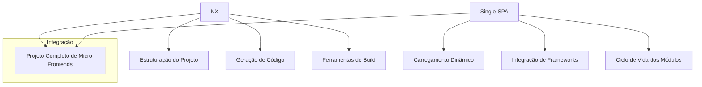

# 🏗️ Micro Frontends com Angular: Arquitetura Moderna de Desenvolvimento

## Introdução

Micro Frontends é uma arquitetura revolucionária que transforma o desenvolvimento de aplicações web complexas, permitindo:

- 🤝 Desenvolvimento descentralizado e autônomo
- 🚀 Escalabilidade de times
- 💡 Inovação tecnológica
- 🔒 Isolamento de responsabilidades

### 🌐 Diagrama Conceitual de Micro Frontends



## 🧩 Conceitos Fundamentais

### 🔍 O que são Micro Frontends?

**Definição Técnica**: Uma estratégia arquitetural que divide uma aplicação frontend em módulos menores, independentes e autocontidos.

#### 🏆 Benefícios Principais

1. **Escalabilidade de Times** 
   - Equipes pequenas e especializadas
   - Desenvolvimento paralelo
   - Redução da complexidade cognitiva

2. **Autonomia Tecnológica**
   - Liberdade para escolher tecnologias
   - Atualização incremental
   - Experimentação facilitada

3. **Manutenção Simplificada**
   - Código modular
   - Menor superfície de impacto
   - Testes mais granulares

## 🚀 Implementação com Angular

### 1. Module Federation - Arquitetura Recomendada

#### 🛠️ Por que Module Federation?

- **Dinamismo**: Carregamento dinâmico de módulos
- **Performance**: Compartilhamento eficiente de dependências
- **Flexibilidade**: Arquitetura plugin-like

```typescript
// Configuração Webpack
const ModuleFederationPlugin = require('webpack/lib/container/ModuleFederationPlugin');

module.exports = {
  plugins: [
    new ModuleFederationPlugin({
      name: 'host',
      remotes: {
        // Mapeamento de micro frontends
        catalogo: "catalogo@http://localhost:3001/remoteEntry.js",
        carrinho: "carrinho@http://localhost:3002/remoteEntry.js"
      },
      shared: {
        // Dependências compartilhadas
        "@angular/core": { singleton: true, strictVersion: true },
        "@angular/common": { singleton: true, strictVersion: true }
      }
    })
  ]
}
```

### 2. Estratégias de Comunicação

#### 📡 Métodos de Integração

1. **Eventos Customizados**
   - Baixo acoplamento
   - Comunicação assíncrona

2. **Serviços Compartilhados**
   - Estado global
   - Gerenciamento centralizado

```typescript
// Exemplo de Serviço de Comunicação
@Injectable({ providedIn: 'root' })
export class CommunicationService {
  private eventBus = new Subject<any>();

  broadcast(event: string, payload: any) {
    this.eventBus.next({ event, payload });
  }

  listen(eventName: string): Observable<any> {
    return this.eventBus.pipe(
      filter(message => message.event === eventName),
      map(message => message.payload)
    );
  }
}
```

## 🛡️ Melhores Práticas

### Design System Unificado



### Performance e Carregamento

- ⚡ Lazy Loading
- 🔬 Code Splitting
- 📦 Otimização de dependências

## 🚧 Desafios e Soluções

1. **Consistência**
   - Design System
   - Testes de Integração
   - Documentação Viva

2. **Performance**
   - Carregamento Sob Demanda
   - Cache Inteligente
   - Otimização de Pacotes

## 🔧 Ferramentas Recomendadas

- 🌐 **Single-SPA**: Orquestração de Micro Frontends
- 🧩 **Nx**: Monorepo e Ferramentas de Build
- 🔍 **Webpack 5**: Module Federation


## 🔍 Single-SPA vs NX: Papéis Distintos em Micro Frontends

### 🧩 NX: Ferramenta de Desenvolvimento e Monorepo

### 🏗️ O que é NX?
- **Ferramenta de Build e Gerenciamento de Monorepo**
- Foco em: 
  - Estruturação de projetos
  - Geração de código
  - Ferramentas de build
  - Compartilhamento de código entre projetos

### 🔑 Principais Características do NX
- Suporte a múltiplos frameworks
- Geração de scaffolding
- Otimização de builds
- Ferramentas de teste e lint
- Compartilhamento de código entre aplicações

## 🌐 Single-SPA: Orquestrador de Micro Frontends

### 🚀 O que é Single-SPA?
- **Framework para Integração de Micro Frontends**
- Foco em:
  - Carregamento dinâmico de aplicações
  - Ciclo de vida de múltiplos frameworks
  - Integração de aplicações independentes

### 🔌 Funcionalidades Únicas
- Suporte a múltiplos frameworks (React, Angular, Vue)
- Gerenciamento de ciclo de vida de micro frontends
- Roteamento entre aplicações diferentes
- Carregamento sob demanda

## 🤝 Como Eles se Complementam



### 📐 Exemplo de Uso Combinado

1. **NX para Estruturação**
```bash
# Cria um workspace de micro frontends
npx create-nx-workspace@latest micro-frontend-app
cd micro-frontend-app

# Gera aplicações de micro frontends
nx generate @nrwl/angular:application products
nx generate @nrwl/angular:application cart
```

2. **Single-SPA para Orquestração**
```typescript
// root-config.ts
import { registerApplication, start } from 'single-spa';

registerApplication({
  name: '@org/products',
  app: () => System.import('@org/products'),
  activeWhen: '/products'
});

registerApplication({
  name: '@org/cart',
  app: () => System.import('@org/cart'),
  activeWhen: '/cart'
});

start();
```

## 🏆 Quando Usar Cada Um

### 🟢 Use NX Quando:
- Precisa de ferramentas de monorepo
- Quer padronização de projetos
- Necessita de geração de código
- Busca otimização de build

### 🔵 Use Single-SPA Quando:
- Tem múltiplos frameworks
- Precisa de carregamento dinâmico
- Quer integrar aplicações independentes
- Necessita de roteamento entre micro frontends

## 💡 Melhor Cenário: Uso Combinado

Na prática, NX e Single-SPA trabalham perfeitamente juntos:
- NX gerencia a estrutura e build
- Single-SPA orquestra a integração
- Resultado: Arquitetura de micro frontends robusta e flexível

**NX ≠ Single-SPA**
- São ferramentas complementares
- Resolvem problemas diferentes
- Juntas, criam uma solução poderosa de micro frontends

## 🏁 Conclusão
Micro Frontends não é apenas uma tendência, mas uma evolução arquitetural que permite:

🚀 Escalabilidade
💡 Inovação
🤝 Colaboração Eficiente

## 📊 Quando Usar

✅ Projetos Grandes
✅ Times Distribuídos
✅ Alta Complexidade de Domínio
❌ Aplicações Pequenas
❌ Times Únicos

**Adote com Sabedoria!** 🧠
