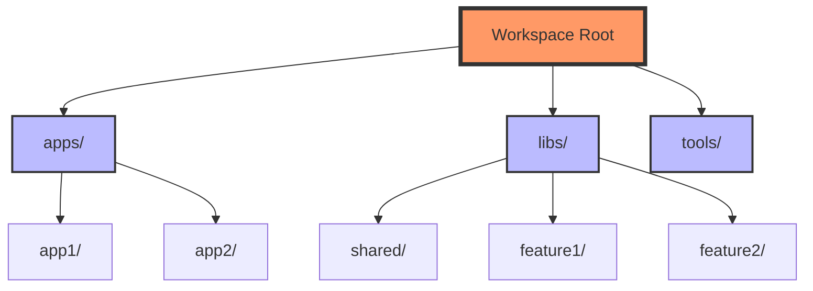
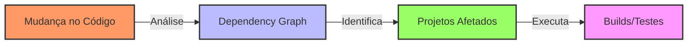
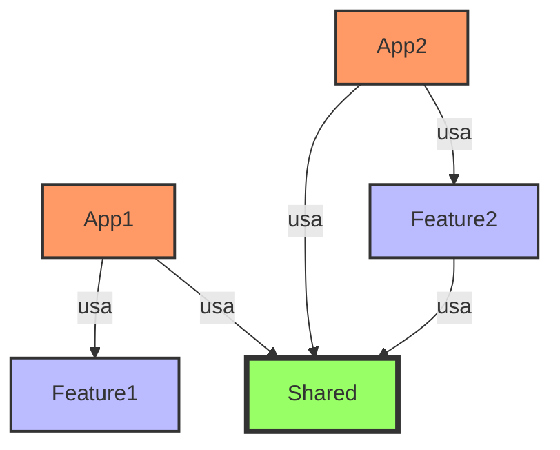
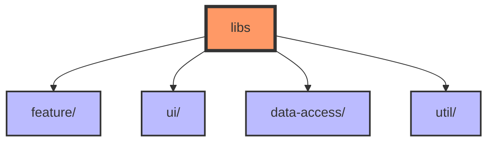
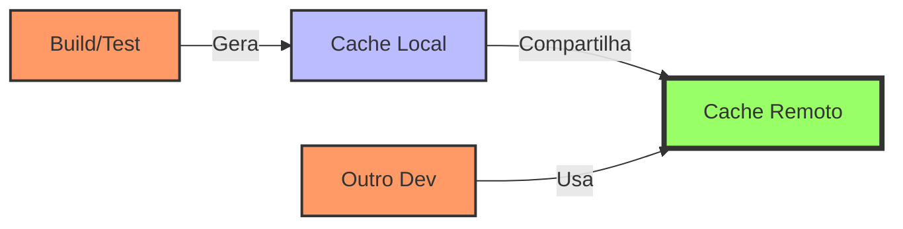

# 🚀 NX Framework: Guia Completo

## 📚 Índice
- [O que é NX?](#-o-que-é-nx)
- [Estrutura do Workspace](#-estrutura-do-workspace)
- [Principais Recursos](#-principais-recursos)
- [Monorepo vs Polyrepo](#-monorepo-vs-polyrepo)
- [Comandos e Ferramentas](#-comandos-e-ferramentas)
- [Boas Práticas](#-boas-práticas)
- [Plugins e Integrações](#-plugins-e-integrações)

## 🎯 O que é NX?

NX é um conjunto de ferramentas de desenvolvimento para arquitetura de monorepo, que permite:
- 🏗️ Gerenciar múltiplos projetos em um único repositório
- 🚀 Build e teste inteligentes e incrementais
- 📦 Compartilhamento de código entre aplicações
- ⚡ Cache distribuído para builds mais rápidos

### Principais Benefícios
1. **Desenvolvimento Escalável**
   - Compartilhamento de código
   - Consistência entre projetos
   - Dependências centralizadas

2. **Performance**
   - Build incremental
   - Cache distribuído
   - Computação afetada

3. **Organização**
   - Estrutura padronizada
   - Governança de código
   - Tooling unificado

## 🏗️ Estrutura do Workspace



### 📁 Organização de Pastas
```
workspace/
├── apps/                  # Aplicações
│   ├── app1/
│   └── app2/
├── libs/                  # Bibliotecas compartilhadas
│   ├── feature1/
│   ├── feature2/
│   └── shared/
├── tools/                 # Ferramentas e scripts
├── nx.json               # Configuração do NX
└── package.json         # Dependências compartilhadas
```

## 🛠️ Principais Recursos

### 1. Computação Afetada



### 2. Dependency Graph



## 🔄 Monorepo vs Polyrepo

### Comparação

| Aspecto | Monorepo (NX) | Polyrepo |
|---------|---------------|-----------|
| Compartilhamento de Código | ✅ Fácil | ❌ Complexo |
| Versionamento | ✅ Unificado | ➖ Individual |
| Build/Deploy | ✅ Otimizado | ❌ Redundante |
| Manutenção | ✅ Centralizada | ❌ Distribuída |
| Escalabilidade | ✅ Gerenciável | ➖ Complexa |

## 🛠️ Comandos e Ferramentas

### Comandos Principais
```bash
# Criar novo workspace
npx create-nx-workspace@latest

# Gerar nova aplicação
nx g @nx/angular:app my-app

# Gerar nova biblioteca
nx g @nx/angular:lib my-lib

# Executar build afetado
nx affected:build

# Visualizar dependency graph
nx dep-graph

# Executar testes
nx test my-app

# Servir aplicação
nx serve my-app
```

### 🎯 Geração de Código
```bash
# Componente
nx g @nx/angular:component my-component --project=my-app

# Serviço
nx g @nx/angular:service my-service --project=my-lib

# Biblioteca
nx g @nx/angular:lib feature-xyz --directory=libs/feature
```

## 📋 Boas Práticas

### 1. Estrutura de Bibliotecas



### 2. Guidelines
- ✅ Use tags para organizar projetos
- ✅ Mantenha bibliotecas pequenas e focadas
- ✅ Siga padrões de nomenclatura consistentes
- ✅ Documente dependências entre projetos
- ❌ Evite dependências circulares
- ❌ Não compartilhe código através de apps

## 🔌 Plugins e Integrações

### Plugins Oficiais
- @nx/angular
- @nx/react
- @nx/nest
- @nx/node
- @nx/cypress
- @nx/jest

### Integrações
- 🔄 CI/CD (GitHub Actions, GitLab CI)
- 📊 Análise de Código (ESLint, SonarQube)
- 📦 Build Tools (Webpack, Vite)
- 🧪 Testing (Jest, Cypress)

## 🚀 Começando com NX

### 1. Instalação
```bash
npx create-nx-workspace@latest my-workspace --preset=angular
cd my-workspace
```

### 2. Configuração Inicial
```json
// nx.json
{
  "tasksRunnerOptions": {
    "default": {
      "runner": "nx/tasks-runners/default",
      "options": {
        "cacheableOperations": [
          "build",
          "test",
          "lint"
        ]
      }
    }
  }
}
```

### 3. Primeiros Passos
1. Criar uma aplicação
2. Adicionar bibliotecas compartilhadas
3. Configurar build e teste
4. Explorar o dependency graph

## 📈 Performance e Otimização

### Cache Distribuído



## 📚 Recursos Adicionais

### 🔗 Links Úteis
- [Documentação Oficial NX](https://nx.dev)
- [Guia de Migração](https://nx.dev/migration/migration-angular)
- [Exemplos de Projetos](https://github.com/nrwl/nx-examples)
- [Blog NX](https://blog.nrwl.io/)

### 💡 Dicas Finais
- Comece pequeno e expanda gradualmente
- Use o dependency graph para visualizar relações
- Aproveite o sistema de cache
- Mantenha a documentação atualizada
- Participe da comunidade NX

Esta documentação fornece:
- Visão geral completa do NX
- Diagramas explicativos
- Exemplos práticos
- Boas práticas
- Recursos para aprendizado
