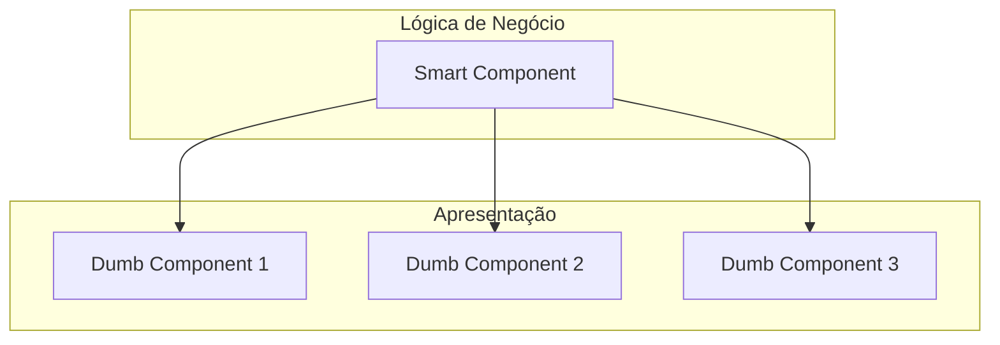

# 🎯 Guia de Perguntas e Respostas para Entrevistas Angular

[](https://angular.io/)
[](https://www.typescriptlang.org/)

## 📋 Índice
- [Gestão de Injeção de Dependência](#-gestão-de-injeção-de-dependência)
- [Controle de Memory Leak](#-controle-de-memory-leak)
- [Smart vs Dumb Components](#-smart-vs-dumb-components)
- [Componentes OnPush](#-componentes-onpush)
- [Componentes Standalone](#-componentes-standalone)
- [Otimização de Performance](#-otimização-de-performance)

## 💉 Gestão de Injeção de Dependência

### Pergunta:
Como gerenciar e fazer gestão de dependências no Angular?

### Resposta Completa:
1. **Comportamento Padrão (Singleton)**
   - Por padrão, o Angular utiliza o padrão Singleton
   - A instância é criada na primeira utilização
   - Permanece viva durante todo o ciclo de vida da aplicação

2. **Modificadores de Injeção**
   - `@Self`: Cria instância específica para o componente
   - `@Host`: Limita injeção ao componente host
   - `@SkipSelf`: Pula o injetor local
   - `@Optional`: Torna a dependência opcional

3. **Exemplo Prático**
```typescript
@Component({
  selector: 'app-example',
  providers: [
    { provide: MyService }  // Instância específica para este componente
  ]
})
export class ExampleComponent {
  constructor(@Self() private myService: MyService) {}
}
```

```mermaid
flowchart TD
    A[Início da Aplicação] --> B[Criação da Instância do Serviço]
    B --> C{Tipo de Injeção}
    C -->|Padrão/Singleton| D[Uma Única Instância na Aplicação]
    C -->|@Self| E[Instância Específica do Componente]
    D --> F[Morre com a Aplicação]
    E --> G[Morre com o Componente]
```

## 🔍 Controle de Memory Leak

### Pergunta:
Como você, como desenvolvedor, faz para controlar memory leak no Angular?

### Resposta Completa:
1. **Principais Causas**
   - Observables não "desinscritos"
   - Event listeners não removidos
   - Intervals/Timeouts não limpos

2. **Soluções**:
   ```typescript
   export class ExampleComponent implements OnDestroy {
     private destroy$ = new Subject<void>();

     ngOnInit() {
       // Para requisições HTTP únicas
       this.http.get('/api/data')
         .pipe(take(1))
         .subscribe();

       // Para Observables contínuos
       this.someService.getData()
         .pipe(takeUntil(this.destroy$))
         .subscribe();
     }

     ngOnDestroy() {
       this.destroy$.next();
       this.destroy$.complete();
     }
   }
   ```

3. **Boas Práticas**
   - Usar operadores RxJS como `take(1)` para valores únicos
   - Implementar `takeUntil` com destroy$ para múltiplos valores
   - Utilizar AsyncPipe quando possível
   - Sempre implementar OnDestroy quando necessário

## 🎭 Smart vs Dumb Components

### Pergunta:
Qual a diferença entre Smart e Dumb Components?

### Resposta:
1. **Smart Components (Componentes Inteligentes)**
   - Contém lógica de negócio
   - Gerenciam estado
   - Possuem injeção de dependências
   - Coordenam outros componentes
   - Exemplo: Componentes de página

2. **Dumb Components (Componentes de Apresentação)**
   - Focados apenas em apresentação
   - Não possuem dependências
   - Recebem dados via @Input()
   - Emitem eventos via @Output()
   - Exemplo: Botões, cards, inputs



## ⚡ Componentes OnPush

### Pergunta:
O que é Change Detection Strategy OnPush e quando usar?

### Resposta:
1. **Conceito**
   - Estratégia de detecção de mudanças mais performática
   - Componente só atualiza em situações específicas

2. **Quando o Componente Atualiza**
   - Mudança em propriedade @Input
   - Evento emitido dentro do componente
   - Uso do ChangeDetectorRef
   - Atualização via AsyncPipe

3. **Implementação**
```typescript
@Component({
  selector: 'app-example',
  changeDetection: ChangeDetectionStrategy.OnPush
})
export class ExampleComponent {
  @Input() data: any;
}
```

## 🆕 Componentes Standalone

### Pergunta:
Como migrar uma aplicação para Standalone Components?

### Resposta:
1. **Características**
   - Não necessitam de NgModule
   - Auto-contidos
   - Melhor tree-shaking
   - Mais fáceis de testar

2. **Estratégia de Migração**
```typescript
@Component({
  selector: 'app-example',
  standalone: true,
  imports: [CommonModule, RouterModule],
  templateUrl: './example.component.html'
})
export class ExampleComponent {}
```

## 🚀 Otimização de Performance

### Dicas de Otimização:
1. **Lazy Loading**
   - Carregamento sob demanda de módulos
   - Reduz bundle inicial

2. **Técnicas de Otimização**
   - Usar OnPush quando possível
   - Implementar Virtual Scrolling
   - Utilizar preload strategies
   - Otimizar builds de produção

3. **Configuração de Build**
```json
{
  "configurations": {
    "production": {
      "optimization": true,
      "aot": true,
      "buildOptimizer": true
    }
  }
}
```

## 📚 Recursos Adicionais
- [Documentação Oficial Angular](https://angular.io/docs)
- [Documentação RxJS](https://rxjs.dev)
- [Angular Style Guide](https://angular.io/guide/styleguide)

## 💡 Dicas para Entrevista
1. Sempre exemplifique com casos de uso reais
2. Demonstre conhecimento de boas práticas
3. Explique os conceitos de forma clara e objetiva
4. Mencione experiências práticas quando possível
5. Esteja preparado para perguntas sobre performance e otimização

## ⚠️ Pontos de Atenção
- Memory leaks são considerados conhecimento essencial
- Entenda profundamente injeção de dependências
- Saiba explicar estratégias de performance
- Conheça os novos recursos do Angular
