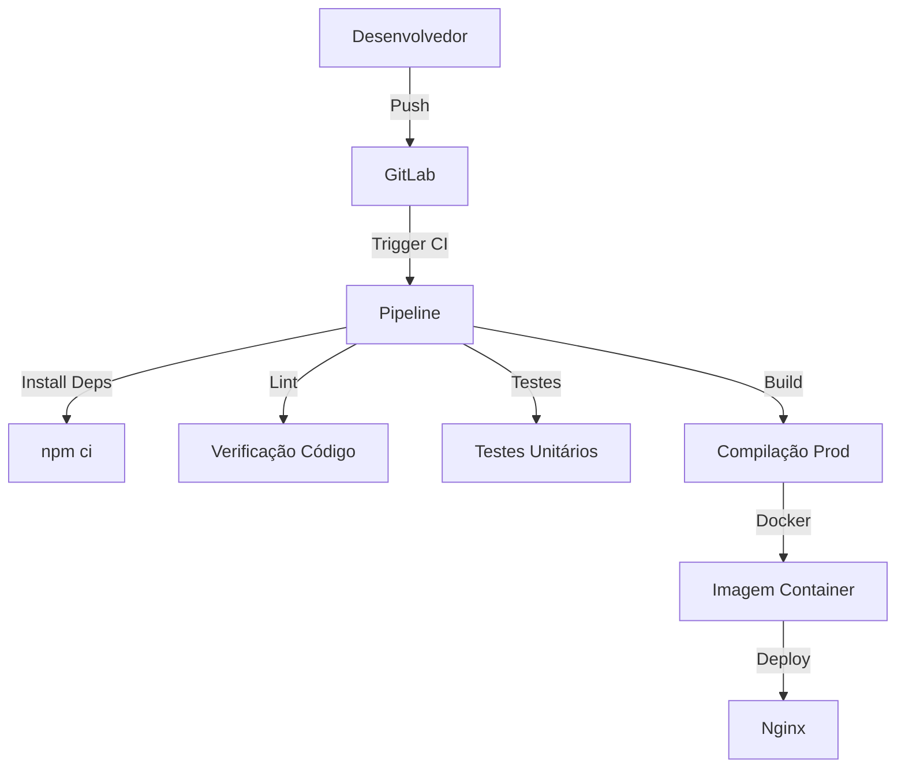

# 🅰️ Pipeline CI/CD: Angular, Docker e Nginx

## 🚀 Arquitetura Moderna de Frontend

### 🏗 Stack Tecnológica
- **Frontend**: Angular 
- **Containerização**: Docker
- **Servidor Web**: Nginx
- **CI/CD**: GitLab CI

### 🔧 Configurações Essenciais

#### Dockerfile Frontend
```dockerfile
# Estágio de Build
FROM node:16-alpine AS build
WORKDIR /app
COPY package*.json ./
RUN npm install
COPY . .
RUN npm run build --prod

# Estágio de Produção
FROM nginx:alpine
COPY --from=build /app/dist/meu-projeto /usr/share/nginx/html
COPY nginx.conf /etc/nginx/conf.d/default.conf
EXPOSE 80
CMD ["nginx", "-g", "daemon off;"]
```

#### Nginx Configuration
```nginx
server {
    listen 80;
    location / {
        root /usr/share/nginx/html;
        index index.html index.htm;
        try_files $uri $uri/ /index.html =404;
    }
}
```

### 🔄 Pipeline GitLab CI/CD
```yaml
stages:
  - install
  - lint
  - test
  - build
  - deploy

install:
  stage: install
  script:
    - npm ci

lint:
  stage: lint
  script:
    - npm run lint

unit-tests:
  stage: test
  script:
    - npm run test:ci

build:
  stage: build
  script:
    - npm run build:prod
  artifacts:
    paths:
      - dist/

deploy-staging:
  stage: deploy
  script:
    - docker build -t frontend:$CI_COMMIT_SHORT_SHA .
    - docker push registry/frontend:$CI_COMMIT_SHORT_SHA
  only:
    - develop

deploy-production:
  stage: deploy
  script:
    - docker-compose up -d
  only:
    - main
```

### 🌐 Fluxo de Integração Contínua



### 🔒 Práticas de Segurança
- Imagens minimizadas
- Compilação em múltiplos estágios
- Testes automatizados
- Segurança de dependências

### 📊 Métricas 
- Performance do build
- Cobertura de testes
- Tempo de deploy
- Qualidade de código

### 🚨 Requisitos
- Node.js 16+
- Angular CLI
- Docker
- GitLab Runner

### 🔍 Melhorias Futuras
- E2E Testing
- Performance Budgets
- Feature Flags
- Monitoramento Real Time

### 📄 Licença
MIT License
