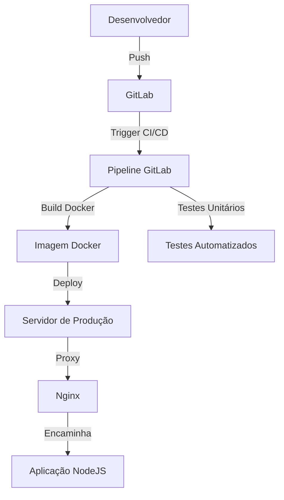

# 🚀 Pipeline CI/CD: NodeJS, Docker e Nginx 

## 📋 Arquitetura de Continuous Integration e Continuous Deployment

### 🏗 Stack Tecnológica
- **Backend**: NodeJS
- **Containerização**: Docker 
- **Proxy/Servidor Web**: Nginx
- **CI/CD**: GitLab CI

### 🔧 Componentes do Projeto

#### Dockerfile
```dockerfile
# Imagem base
FROM node:16-alpine

# Diretório de trabalho
WORKDIR /app

# Copia package.json e instala dependências
COPY package*.json ./
RUN npm install

# Copia código fonte
COPY . .

# Porta da aplicação
EXPOSE 3000

# Comando de start
CMD ["npm", "start"]
```

#### Nginx Configuration
```nginx
server {
    listen 80;
    server_name api.example.com;

    location / {
        proxy_pass http://nodejs-app:3000;
        proxy_http_version 1.1;
        proxy_set_header Upgrade $http_upgrade;
        proxy_set_header Connection 'upgrade';
        proxy_set_header Host $host;
        proxy_cache_bypass $http_upgrade;
    }
}
```

### 🔄 Pipeline GitLab CI/CD
```yaml
stages:
  - build
  - test
  - deploy

variables:
  DOCKER_IMAGE: $CI_REGISTRY_IMAGE:$CI_COMMIT_SHORT_SHA

build:
  stage: build
  image: docker:latest
  services:
    - docker:dind
  script:
    - docker build -t $DOCKER_IMAGE .
    - docker push $DOCKER_IMAGE

unit-tests:
  stage: test
  image: $DOCKER_IMAGE
  script:
    - npm run test

deploy-production:
  stage: deploy
  script:
    - docker-compose up -d
  only:
    - main
```

### 🌐 Infraestrutura Arquitetural



### 🔒 Boas Práticas Implementadas
- Container imutável
- Build apenas uma vez
- Testes automatizados
- Deploy controlado
- Segurança com imagens oficiais

### 📊 Métricas e Monitoramento
- Logs centralizados
- Health checks 
- Rollback automático
- Notificações de status

### 🚨 Requisitos
- Docker
- Docker Compose
- GitLab Runner
- Servidor com suporte Docker

### 🔍 Próximos Passos
- Implementar monitoramento Prometheus
- Adicionar testes de integração
- Configurar CD com Kubernetes

### 📄 Licença
MIT Open Source
