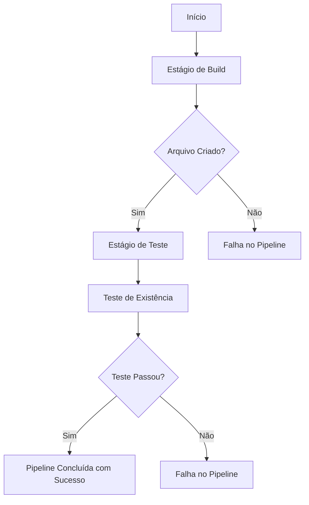

# 🚀 Tutorial Básico de GitLab CI/CD

## 📘 Visão Geral
Este projeto demonstra os conceitos fundamentais de Integração e Implantação Contínua (CI/CD) usando GitLab CI, criado para desenvolvedores que estão iniciando na jornada de DevOps.

## 🎯 Objetivos do Tutorial
- Introduzir conceitos básicos de pipelines no GitLab CI
- Demonstrar a criação de estágios e jobs
- Explicar o uso de imagens Docker em pipelines
- Mostrar como configurar artefatos em pipelines

## 🛠 Componentes Principais

### Pipeline de Exemplo
O pipeline criado possui dois estágios principais:
1. **Estágio de Build**: Criação de um arquivo
2. **Estágio de Teste**: Verificação da existência do arquivo criado

### Conceitos Abordados
- Configuração do arquivo `.gitlab-ci.yml`
- Uso de imagem Alpine Linux
- Definição de estágios
- Execução de comandos shell
- Gerenciamento de artefatos

## 📋 Pré-requisitos
- Conta no GitLab.com
- Navegador web
- Conhecimentos básicos de Linux e linha de comando

## 🔍 Detalhes Técnicos

### Configuração do Pipeline
```yaml
stages:
  - build
  - test

create_file:
  stage: build
  image: alpine
  script:
    - mkdir build
    - touch build/file.txt
  artifacts:
    paths:
      - build/

test_file:
  stage: test
  image: alpine
  script:
    - test -f build/file.txt
```

## 🚨 Pontos de Atenção
- A indentação no YAML é crítica
- Cada job é executado em um container separado
- Artefatos são essenciais para compartilhar dados entre jobs

## 📚 Próximos Passos
- Aprender sobre variáveis de ambiente
- Entender testes automatizados
- Explorar implantação em diferentes ambientes

## 🔗 Recursos Adicionais
- [Documentação Oficial do GitLab CI/CD](https://docs.gitlab.com/ee/ci/)
- [Tutorial Completo de DevOps](https://example.com/devops-course)

## 👨‍💻 Autor
Tutorial original por um entusiasta de DevOps, adaptado e documentado para facilitar o aprendizado.

## 📄 Licença
Projeto de código aberto para fins educacionais.

---

### 🌈 Diagrama do Pipeline



## 🚀 Como Começar
1. Faça login no GitLab.com
2. Crie um novo projeto
3. Copie o `.gitlab-ci.yml`
4. Faça commit e observe o pipeline
